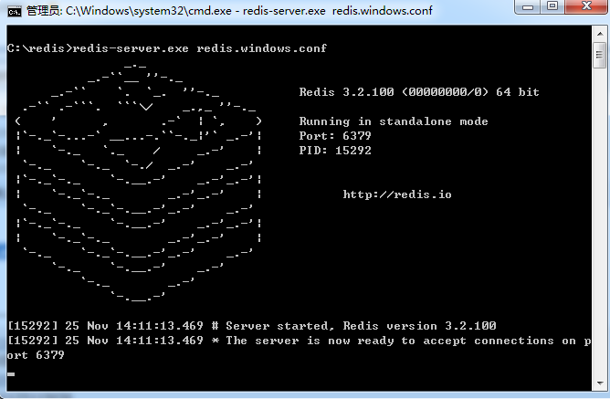

[https://redis.io](https://redis.io)

学习资料来自[Redis 教程](http://www.runoob.com/redis/redis-tutorial.html)

[简介](#redis-简介)

[安装](#redis-安装)

[配置](#redis-配置)

[数据类型](#redis-数据类型)

[命令](#redis-命令)

[键(key)](#redis-键key)

[字符串(String)](#redis-字符串String)

[哈希(Hash)](#redis-哈希Hash)

[列表(List)](#redis-列表List)

[集合(Set)](#redis-集合Set)

[有序集合(sorted set)](#redis-有序集合sorted-set)

[HyperLogLog 基数](#redis-hyperLogLog)

[发布订阅](#redis-发布订阅)

[事务](#redis-事务)

[脚本](#redis-脚本)

[连接](#redis-连接)

[服务器](#redis-服务器)

[数据备份与恢复](#redis-数据备份与恢复)

[安全](#redis-安全)

[性能测试](#redis-性能测试)

[客户端连接](#redis-客户端连接)

[管道技术](#redis-管道技术)

[分区](#redis-分区)

[Java 使用 Redis](#redis-Java-使用-Redis)

# Redis 简介 #
Redis 是完全开源免费的，遵守BSD协议，是一个高性能的key-value数据库。

Redis 与其他 key - value 缓存产品有以下三个特点：

- Redis支持数据的**持久化**，可以将内存中的数据保存在磁盘中，重启的时候可以再次加载进行使用。
- Redis不仅仅支持简单的key-value类型的数据，同时还提供list，set，zset，hash等数据结构的存储。
- Redis支持数据的备份，即master-slave模式的数据备份。

---

## Redis 优势 ##
- 性能极高 – Redis能读的速度是110000次/s,写的速度是81000次/s 。
- 丰富的数据类型 – Redis支持二进制案例的 Strings, Lists, Hashes, Sets 及 Ordered Sets 数据类型操作。
- 原子（一不做，二不休） – Redis的所有操作都是原子性的，意思就是要么成功执行要么失败完全不执行。单个操作是原子性的。多个操作也支持事务，即原子性，通过MULTI和EXEC指令包起来。
- 丰富的特性 – Redis还支持 publish/subscribe, 通知, key 过期等等特性。

## Redis与其他key-value存储有什么不同？ ##
Redis有着更为复杂的数据结构并且提供对他们的原子性操作，这是一个不同于其他数据库的进化路径。Redis的数据类型都是基于基本数据结构的同时对程序员透明，无需进行额外的抽象。

Redis运行在内存中但是可以**持久化**到磁盘，所以在对不同数据集进行高速读写时需要权衡内存，因为数据量不能大于硬件内存。在内存数据库方面的另一个优点是，相比在磁盘上相同的**复杂的数据结构**，在内存中操作起来非常简单，这样Redis可以做很多内部复杂性很强的事情。同时，在磁盘格式方面他们是紧凑的以追加的方式产生的，因为他们并不需要进行随机访问。

# Redis 安装 #
## Window 下安装 ##

[下载地址](https://github.com/MSOpenTech/redis/releases)

1.Redis 支持 32 位和 64 位。这个需要根据你系统平台的实际情况选择，这里我们下载 Redis-x64-xxx.zip压缩包到 C 盘，解压后，将文件夹重新命名为 redis。

2.打开一个 cmd 窗口 使用cd命令切换目录到 C:\redis 运行

	redis-server.exe redis.windows.conf 。

如果想方便的话，可以把 redis 的路径加到系统的环境变量里，这样就省得再输路径了，后面的那个 redis.windows.conf 可以省略，如果省略，会启用默认的。输入之后，会显示如下界面：

3.这时候另启一个cmd窗口，原来的不要关闭，不然就无法访问服务端了。

切换到redis目录下运行 
	
	redis-cli.exe -h 127.0.0.1 -p 6379 。

设置键值对 

	set myKey abc

取出键值对 
	
	get myKey

# Redis 配置 #
Redis 的配置文件位于 Redis 安装目录下，文件名为 redis.conf（Windows的是redis.windows.conf）。

你可以通过 CONFIG 命令查看或设置配置项。

---

## 语法 ##
Redis CONFIG 命令格式如下：

	redis 127.0.0.1:6379> CONFIG GET CONFIG_SETTING_NAME
## 实例 ##
	redis 127.0.0.1:6379> CONFIG GET loglevel
	
	1) "loglevel"
	2) "notice"
使用 * 号获取所有配置项：

	redis 127.0.0.1:6379> CONFIG GET *
	
	  1) "dbfilename"
	  2) "dump.rdb"
	  3) "requirepass"
	  4) ""
	  5) "masterauth"
	  6) ""
	  7) "unixsocket"
	  8) ""
	  9) "logfile"
	 10) ""
	 11) "pidfile"
	 12) "/var/run/redis.pid"
	 13) "maxmemory"
	 14) "0"
	 15) "maxmemory-samples"
	 16) "3"
	 17) "timeout"
	 18) "0"
	 19) "tcp-keepalive"
	 20) "0"
	 21) "auto-aof-rewrite-percentage"
	 22) "100"
	 23) "auto-aof-rewrite-min-size"
	 24) "67108864"
	 25) "hash-max-ziplist-entries"
	 26) "512"
	 27) "hash-max-ziplist-value"
	 28) "64"
	 29) "list-max-ziplist-entries"
	 30) "512"
	 31) "list-max-ziplist-value"
	 32) "64"
	 33) "set-max-intset-entries"
	 34) "512"
	 35) "zset-max-ziplist-entries"
	 36) "128"
	 37) "zset-max-ziplist-value"
	 38) "64"
	 39) "hll-sparse-max-bytes"
	 40) "3000"
	 41) "lua-time-limit"
	 42) "5000"
	 43) "slowlog-log-slower-than"
	 44) "10000"
	 45) "latency-monitor-threshold"
	 46) "0"
	 47) "slowlog-max-len"
	 48) "128"
	 49) "port"
	 50) "6379"
	 51) "tcp-backlog"
	 52) "511"
	 53) "databases"
	 54) "16"
	 55) "repl-ping-slave-period"
	 56) "10"
	 57) "repl-timeout"
	 58) "60"
	 59) "repl-backlog-size"
	 60) "1048576"
	 61) "repl-backlog-ttl"
	 62) "3600"
	 63) "maxclients"
	 64) "4064"
	 65) "watchdog-period"
	 66) "0"
	 67) "slave-priority"
	 68) "100"
	 69) "min-slaves-to-write"
	 70) "0"
	 71) "min-slaves-max-lag"
	 72) "10"
	 73) "hz"
	 74) "10"
	 75) "no-appendfsync-on-rewrite"
	 76) "no"
	 77) "slave-serve-stale-data"
	 78) "yes"
	 79) "slave-read-only"
	 80) "yes"
	 81) "stop-writes-on-bgsave-error"
	 82) "yes"
	 83) "daemonize"
	 84) "no"
	 85) "rdbcompression"
	 86) "yes"
	 87) "rdbchecksum"
	 88) "yes"
	 89) "activerehashing"
	 90) "yes"
	 91) "repl-disable-tcp-nodelay"
	 92) "no"
	 93) "aof-rewrite-incremental-fsync"
	 94) "yes"
	 95) "appendonly"
	 96) "no"
	 97) "dir"
	 98) "/home/deepak/Downloads/redis-2.8.13/src"
	 99) "maxmemory-policy"
	100) "volatile-lru"
	101) "appendfsync"
	102) "everysec"
	103) "save"
	104) "3600 1 300 100 60 10000"
	105) "loglevel"
	106) "notice"
	107) "client-output-buffer-limit"
	108) "normal 0 0 0 slave 268435456 67108864 60 pubsub 33554432 8388608 60"
	109) "unixsocketperm"
	110) "0"
	111) "slaveof"
	112) ""
	113) "notify-keyspace-events"
	114) ""
	115) "bind"
	116) ""
## 编辑配置 ##
你可以通过修改 redis.conf 文件或使用 CONFIG set 命令来修改配置。

**语法**
CONFIG SET 命令基本语法：

	redis 127.0.0.1:6379> CONFIG SET CONFIG_SETTING_NAME NEW_CONFIG_VALUE

**实例**

	redis 127.0.0.1:6379> CONFIG SET loglevel "notice"
	OK
	redis 127.0.0.1:6379> CONFIG GET loglevel
	
	1) "loglevel"
	2) "notice"

## 参数说明 ##

redis.conf 配置项说明如下：

1.Redis默认不是以守护进程的方式运行，可以通过该配置项修改，使用yes启用守护进程

    daemonize no

2.当Redis以守护进程方式运行时，Redis默认会把pid写入/var/run/redis.pid文件，可以通过pidfile指定

    pidfile /var/run/redis.pid

3.指定Redis监听端口，默认端口为6379，作者在自己的一篇博文中解释了为什么选用6379作为默认端口，因为6379在手机按键上MERZ对应的号码，而MERZ取自意大利歌女Alessia Merz的名字

    port 6379

4.绑定的主机地址

    bind 127.0.0.1

5.当 客户端闲置多长时间后关闭连接，如果指定为0，表示关闭该功能

    timeout 300

6.指定日志记录级别，Redis总共支持四个级别：debug、verbose、notice、warning，默认为verbose

    loglevel verbose

7.日志记录方式，默认为标准输出，如果配置Redis为守护进程方式运行，而这里又配置为日志记录方式为标准输出，则日志将会发送给/dev/null

    logfile stdout

8.设置数据库的数量，默认数据库为0，可以使用SELECT <dbid>命令在连接上指定数据库id

    databases 16

9.指定在多长时间内，有多少次更新操作，就将数据同步到数据文件，可以多个条件配合

    save <seconds> <changes>

    Redis默认配置文件中提供了三个条件：

    save 900 1

    save 300 10

    save 60 10000

    分别表示900秒（15分钟）内有1个更改，300秒（5分钟）内有10个更改以及60秒内有10000个更改。

 

10.指定存储至本地数据库时是否压缩数据，默认为yes，Redis采用LZF压缩，如果为了节省CPU时间，可以关闭该选项，但会导致数据库文件变的巨大

    rdbcompression yes

11.指定本地数据库文件名，默认值为dump.rdb

    dbfilename dump.rdb

12.指定本地数据库存放目录

    dir ./

13.设置当本机为slav服务时，设置master服务的IP地址及端口，在Redis启动时，它会自动从master进行数据同步

    slaveof <masterip> <masterport>

14.当master服务设置了密码保护时，slav服务连接master的密码

    masterauth <master-password>

15.设置Redis连接密码，如果配置了连接密码，客户端在连接Redis时需要通过AUTH <password>命令提供密码，默认关闭

    requirepass foobared

16.设置同一时间最大客户端连接数，默认无限制，Redis可以同时打开的客户端连接数为Redis进程可以打开的最大文件描述符数，如果设置 maxclients 0，表示不作限制。当客户端连接数到达限制时，Redis会关闭新的连接并向客户端返回max number of clients reached错误信息

    maxclients 128

17.指定Redis最大内存限制，Redis在启动时会把数据加载到内存中，达到最大内存后，Redis会先尝试清除已到期或即将到期的Key，当此方法处理 后，仍然到达最大内存设置，将无法再进行写入操作，但仍然可以进行读取操作。Redis新的vm机制，会把Key存放内存，Value会存放在swap区

    maxmemory <bytes>

18.指定是否在每次更新操作后进行日志记录，Redis在默认情况下是异步的把数据写入磁盘，如果不开启，可能会在断电时导致一段时间内的数据丢失。因为 redis本身同步数据文件是按上面save条件来同步的，所以有的数据会在一段时间内只存在于内存中。默认为no

    appendonly no

19.指定更新日志文件名，默认为appendonly.aof

     appendfilename appendonly.aof

20.指定更新日志条件，共有3个可选值： 
    no：表示等操作系统进行数据缓存同步到磁盘（快） 
    always：表示每次更新操作后手动调用fsync()将数据写到磁盘（慢，安全） 
    everysec：表示每秒同步一次（折衷，默认值）

    appendfsync everysec

21.指定是否启用虚拟内存机制，默认值为no，简单的介绍一下，VM机制将数据分页存放，由Redis将访问量较少的页即冷数据swap到磁盘上，访问多的页面由磁盘自动换出到内存中（在后面的文章我会仔细分析Redis的VM机制）

     vm-enabled no

22.虚拟内存文件路径，默认值为/tmp/redis.swap，不可多个Redis实例共享

     vm-swap-file /tmp/redis.swap

23.将所有大于vm-max-memory的数据存入虚拟内存,无论vm-max-memory设置多小,所有索引数据都是内存存储的(Redis的索引数据 就是keys),也就是说,当vm-max-memory设置为0的时候,其实是所有value都存在于磁盘。默认值为0

     vm-max-memory 0

24.Redis swap文件分成了很多的page，一个对象可以保存在多个page上面，但一个page上不能被多个对象共享，vm-page-size是要根据存储的 数据大小来设定的，作者建议如果存储很多小对象，page大小最好设置为32或者64bytes；如果存储很大大对象，则可以使用更大的page，如果不 确定，就使用默认值

     vm-page-size 32

25.设置swap文件中的page数量，由于页表（一种表示页面空闲或使用的bitmap）是在放在内存中的，，在磁盘上每8个pages将消耗1byte的内存。

     vm-pages 134217728

26.设置访问swap文件的线程数,最好不要超过机器的核数,如果设置为0,那么所有对swap文件的操作都是串行的，可能会造成比较长时间的延迟。默认值为4

     vm-max-threads 4

27.设置在向客户端应答时，是否把较小的包合并为一个包发送，默认为开启

    glueoutputbuf yes

28.指定在超过一定的数量或者最大的元素超过某一临界值时，采用一种特殊的哈希算法

    hash-max-zipmap-entries 64

    hash-max-zipmap-value 512

29.指定是否激活重置哈希，默认为开启（后面在介绍Redis的哈希算法时具体介绍）

    activerehashing yes

30.指定包含其它的配置文件，可以在同一主机上多个Redis实例之间使用同一份配置文件，而同时各个实例又拥有自己的特定配置文件

    include /path/to/local.conf

## 什么是守护进程？ ##
**守护进程**（Daemon Process），也就是通常说的 Daemon 进程（精灵进程），是 Linux 中的后台服务进程。它是一个生存期较长的进程，通常独立于控制终端并且周期性地执行某种任务或等待处理某些发生的事件。

守护进程是个特殊的孤儿进程，这种进程脱离终端，为什么要脱离终端呢？之所以脱离于终端是为了避免进程被任何终端所产生的信息所打断，其在执行过程中的信息也不在任何终端上显示。由于在 linux 中，每一个系统与用户进行交流的界面称为终端，每一个从此终端开始运行的进程都会依附于这个终端，这个终端就称为这些进程的控制终端，当控制终端被关闭时，相应的进程都会自动关闭。

# Redis 数据类型 #
Redis支持五种数据类型：string（字符串），hash（哈希），list（列表），set（集合）及zset(sorted set：有序集合)。

## String（字符串） ##
string是redis最基本的类型，你可以理解成与Memcached一模一样的类型，一个key对应一个value。

string类型是二进制安全的。意思是redis的string可以包含任何数据。比如jpg图片或者序列化的对象 。

string类型是Redis最基本的数据类型，一个键最大能存储512MB。

**实例**

	redis 127.0.0.1:6379> SET name "runoob"
	OK
	redis 127.0.0.1:6379> GET name
	"runoob"

在以上实例中我们使用了 Redis 的 SET 和 GET 命令。键为 name，对应的值为 runoob。

**注意**：一个键最大能存储512MB。

## Hash（哈希） ##
Redis hash 是一个键值(key=>value)对集合。

Redis hash 是一个 string 类型的 field 和 value 的映射表，hash 特别适合用于存储对象。

**实例**

	redis> HMSET myhash field1 "Hello" field2 "World"
	"OK"
	redis> HGET myhash field1
	"Hello"
	redis> HGET myhash field2
	"World"

实例中我们使用了 Redis **HMSET, HGET** 命令，HMSET 设置了两个 field=>value 对, HGET 获取对应 field 对应的 value。

每个 hash 可以存储 2^32 -1 键值对（40多亿）。

## List（列表） ##
Redis 列表是简单的字符串列表，按照插入顺序排序。你可以添加一个元素到列表的头部（左边）或者尾部（右边）。

**实例**

	redis 127.0.0.1:6379> lpush runoob redis
	(integer) 1
	redis 127.0.0.1:6379> lpush runoob mongodb
	(integer) 2
	redis 127.0.0.1:6379> lpush runoob rabitmq
	(integer) 3
	redis 127.0.0.1:6379> lrange runoob 0 10
	1) "rabitmq"
	2) "mongodb"
	3) "redis"
	redis 127.0.0.1:6379>

列表最多可存储 2^32 - 1 元素 (4294967295, 每个列表可存储40多亿)。
## Set（集合） ##
Redis的Set是string类型的无序集合。

集合是通过哈希表实现的，所以添加，删除，查找的复杂度都是O(1)。

**sadd 命令**
添加一个 string 元素到 key 对应的 set 集合中，成功返回1，如果元素已经在集合中返回 0，如果 key 对应的 set 不存在则返回错误。

	sadd key member

**实例**

	redis 127.0.0.1:6379> sadd runoob redis
	(integer) 1
	redis 127.0.0.1:6379> sadd runoob mongodb
	(integer) 1
	redis 127.0.0.1:6379> sadd runoob rabitmq
	(integer) 1
	redis 127.0.0.1:6379> sadd runoob rabitmq
	(integer) 0
	redis 127.0.0.1:6379> smembers runoob
	
	1) "redis"
	2) "rabitmq"
	3) "mongodb"
**注意**：以上实例中 rabitmq 添加了两次，但根据集合内元素的唯一性，第二次插入的元素将被忽略。

集合中最大的成员数为 2^32 - 1(4294967295, 每个集合可存储40多亿个成员)。

## zset(sorted set：有序集合) ##
Redis zset 和 set 一样也是string类型元素的集合,且不允许重复的成员。

不同的是每个元素都会关联一个double类型的分数。redis正是通过分数来为集合中的成员进行从小到大的排序。

zset的成员是唯一的,但分数(score)却可以重复。

**zadd 命令**

添加元素到集合，元素在集合中存在则更新对应score

	zadd key score member 
**实例**

	redis 127.0.0.1:6379> zadd runoob 0 redis
	(integer) 1
	redis 127.0.0.1:6379> zadd runoob 0 mongodb
	(integer) 1
	redis 127.0.0.1:6379> zadd runoob 0 rabitmq
	(integer) 1
	redis 127.0.0.1:6379> zadd runoob 0 rabitmq
	(integer) 0
	redis 127.0.0.1:6379> > ZRANGEBYSCORE runoob 0 1000
	1) "mongodb"
	2) "rabitmq"
	3) "redis"

# Redis 命令 #
Redis 命令用于在 redis 服务上执行操作。

要在 redis 服务上执行命令需要一个 redis 客户端。Redis 客户端在我们之前下载的的 redis 的安装包中。

**语法**
Redis 客户端的基本语法为：

	$ redis-cli

**实例**

以下实例讲解了如何启动 redis 客户端：

启动 redis 客户端，打开终端并输入命令 redis-cli。该命令会连接本地的 redis 服务。

	$redis-cli
	redis 127.0.0.1:6379>
	redis 127.0.0.1:6379> PING
	
	PONG

在以上实例中我们连接到本地的 redis 服务并执行 PING 命令，该命令用于检测 redis 服务是否启动。

## 在远程服务上执行命令 ##
如果需要在远程 redis 服务上执行命令，同样我们使用的也是 redis-cli 命令。

**语法**

	$ redis-cli -h host -p port -a password

**实例**

以下实例演示了如何连接到主机为 127.0.0.1，端口为 6379 ，密码为 mypass 的 redis 服务上。

	$redis-cli -h 127.0.0.1 -p 6379 -a "mypass"
	redis 127.0.0.1:6379>
	redis 127.0.0.1:6379> PING
	
	PONG

**有时候会有中文乱码。**

要在 redis-cli 后面加上 --raw

	redis-cli --raw
就可以避免中文乱码了。

# Redis 键(key) #
Redis 键命令用于管理 redis 的键。

**语法**
Redis 键命令的基本语法如下：

	redis 127.0.0.1:6379> COMMAND KEY_NAME

**实例**

	redis 127.0.0.1:6379> SET runoobkey redis
	OK
	redis 127.0.0.1:6379> DEL runoobkey
	(integer) 1

在以上实例中 DEL 是一个命令， runoobkey 是一个键。 如果键被删除成功，命令执行后输出 (integer) 1，否则将输出 (integer) 0

## Redis keys 命令 ##
下表给出了与 Redis 键相关的基本命令：

<table>
<tbody>

<tr><th style="width:5%">序号</th><th>命令及描述</th></tr>

<tr><td>1</td><td><a >DEL key</a> 该命令用于在 key 存在时删除  key。</td></tr>

<tr><td>2</td><td><a >DUMP key</a>  序列化给定 key ，并返回被序列化的值。</td></tr>

<tr><td>3</td><td><a >EXISTS key</a>  检查给定 key 是否存在。</td></tr>

<tr><td>4</td><td><a >EXPIRE key</a> seconds 为给定 key 设置过期时间。</td></tr>

<tr><td>5</td><td><a >EXPIREAT  key timestamp</a>  EXPIREAT 的作用和 EXPIRE 类似，都用于为 key 设置过期时间。

不同在于 EXPIREAT 命令接受的时间参数是 UNIX 时间戳(unix timestamp)。</td></tr>

<tr><td>6</td><td><a >PEXPIRE key milliseconds</a>  设置 key 的过期时间以毫秒计。</td></tr>

<tr><td>7</td><td><a >PEXPIREAT key milliseconds-timestamp</a>  设置 key 过期时间的时间戳(unix timestamp) 以毫秒计</td></tr>

<tr><td>8</td><td><a >KEYS pattern</a>  查找所有符合给定模式( pattern)的 key 。 </td></tr>

<tr><td>9</td><td><a >MOVE key db</a>  将当前数据库的 key 移动到给定的数据库 db 当中。</td></tr>

<tr><td>10</td><td><a >PERSIST key</a>  移除 key 的过期时间，key 将持久保持。</td></tr>

<tr><td>11</td><td><a >PTTL key</a>  以毫秒为单位返回 key 的剩余的过期时间。</td></tr>

<tr><td>12</td><td><a >TTL key</a>  以秒为单位，返回给定 key 的剩余生存时间(TTL, time to live)。</td></tr>

<tr><td>13</td><td><a >RANDOMKEY</a>  从当前数据库中随机返回一个 key 。 </td></tr>

<tr><td>14</td><td><a >RENAME key newkey</a>  修改 key 的名称</td></tr>

<tr><td>15</td><td><a >RENAMENX key newkey</a>  仅当 newkey 不存在时，将 key 改名为 newkey 。</td></tr>

<tr><td>16</td><td><a >TYPE key</a>  返回 key 所储存的值的类型。</td></tr>

</tbody>

</table>

更多命令请参考：[https://redis.io/commands](https://redis.io/commands)

# Redis 字符串(String) #

Redis 字符串数据类型的相关命令用于管理 redis 字符串值，基本语法如下：

**语法**

	redis 127.0.0.1:6379> COMMAND KEY_NAME

**实例**

	redis 127.0.0.1:6379> SET runoobkey redis
	OK
	redis 127.0.0.1:6379> GET runoobkey
	"redis"

在以上实例中我们使用了 SET 和 GET 命令，键为 runoobkey。

## Redis 字符串命令 ##
下表列出了常用的 redis 字符串命令：

<table class="reference">
<tbody>

<tr><th style="width:5%">序号</th><th>命令及描述</th></tr>
<tr><td>1</td><td><a href="">SET key value</a>  设置指定 key 的值</td></tr>

<tr><td>2</td><td><a href="">GET key</a>  获取指定 key 的值。</td></tr>

<tr><td>3</td><td><a href="">GETRANGE key start end</a>  返回 key 中字符串值的子字符</td></tr>

<tr><td>4</td><td><a href="">GETSET key value</a> 将给定 key 的值设为 value ，并返回 key 的旧值(old value)。</td></tr>

<tr><td>5</td><td><a href="">GETBIT key offset</a> 对 key 所储存的字符串值，获取指定偏移量上的位(bit)。</td></tr>

<tr><td>6</td><td><a href="">MGET key1 [key2..]</a> 获取所有(一个或多个)给定 key 的值。 </td></tr>

<tr><td>7</td><td><a href="">SETBIT key offset value</a> 对 key 所储存的字符串值，设置或清除指定偏移量上的位(bit)。</td></tr>

<tr><td>8</td><td><a href="">SETEX key seconds value</a> 将值 value 关联到 key ，并将 key 的过期时间设为 seconds (以秒为单位)。</td></tr>

<tr><td>9</td><td><a href="">SETNX key value</a> 只有在 key 不存在时设置 key 的值。</td></tr>

<tr><td>10</td><td><a href="">SETRANGE key offset value</a> 用 value 参数覆写给定 key 所储存的字符串值，从偏移量 offset 开始。 </td></tr>

<tr><td>11</td><td><a href="">STRLEN key</a> 返回 key 所储存的字符串值的长度。</td></tr>

<tr><td>12</td><td><a href="">MSET key value [key value ...]</a> 同时设置一个或多个 key-value 对。</td></tr>

<tr><td>13</td><td><a href="">MSETNX key value [key value ...]</a>  同时设置一个或多个 key-value 对，当且仅当所有给定 key 都不存在。</td></tr>

<tr><td>14</td><td><a href="">PSETEX key milliseconds value</a> 这个命令和 SETEX 命令相似，但它以毫秒为单位设置 key 的生存时间，而不是像 SETEX 命令那样，以秒为单位。</td></tr>

<tr><td>15</td><td><a href="">INCR key</a> 将 key 中储存的数字值增一。</td></tr>

<tr><td>16</td><td><a href="">INCRBY key increment</a> 将 key 所储存的值加上给定的增量值（increment） 。</td></tr>

<tr><td>17</td><td><a href="">INCRBYFLOAT key increment</a> 将 key 所储存的值加上给定的浮点增量值（increment） 。 </td></tr>

<tr><td>18</td><td><a href="">DECR key</a> 将 key 中储存的数字值减一。</td></tr>

<tr><td>19</td><td><a href="">DECRBY key decrement</a>  key 所储存的值减去给定的减量值（decrement） 。 </td></tr>

<tr><td>20</td><td><a href="">APPEND key value</a> 如果 key 已经存在并且是一个字符串， APPEND 命令将指定的 value 追加到该 key 原来值（value）的末尾。 </td></tr>

</tbody>

</table>

# Redis 列表(List) #

Redis列表是简单的字符串列表，按照插入顺序排序。你可以添加一个元素到列表的头部（左边）或者尾部（右边）

一个列表最多可以包含 2^32 - 1 个元素 (4294967295, 每个列表超过40亿个元素)。

**实例**

	redis 127.0.0.1:6379> LPUSH runoobkey redis
	(integer) 1
	redis 127.0.0.1:6379> LPUSH runoobkey mongodb
	(integer) 2
	redis 127.0.0.1:6379> LPUSH runoobkey mysql
	(integer) 3
	redis 127.0.0.1:6379> LRANGE runoobkey 0 10
	
	1) "mysql"
	2) "mongodb"
	3) "redis"
在以上实例中我们使用了 LPUSH 将三个值插入了名为 runoobkey 的列表当中。

## Redis 列表命令 ##

下表列出了列表相关的基本命令：

<table class="reference">

<tbody>
<tr><th style="width:5%">序号</th><th>命令及描述</th></tr>

<tr><td>1</td><td><a  href="">BLPOP key1 [key2 ] timeout</a>  移出并获取列表的第一个元素， 如果列表没有元素会阻塞列表直到等待超时或发现可弹出元素为止。</td></tr>

<tr><td>2</td><td><a  href="">BRPOP key1 [key2 ] timeout</a>  移出并获取列表的最后一个元素， 如果列表没有元素会阻塞列表直到等待超时或发现可弹出元素为止。</td></tr>

<tr><td>3</td><td><a  href="">BRPOPLPUSH source destination timeout</a>  从列表中弹出一个值，将弹出的元素插入到另外一个列表中并返回它； 如果列表没有元素会阻塞列表直到等待超时或发现可弹出元素为止。</td></tr>

<tr><td>4</td><td><a  href="">LINDEX key index</a>  通过索引获取列表中的元素</td></tr>

<tr><td>5</td><td><a  href="">LINSERT key BEFORE|AFTER pivot value</a>  在列表的元素前或者后插入元素</td></tr>

<tr><td>6</td><td><a  href="">LLEN key</a>  获取列表长度</td></tr>

<tr><td>7</td><td><a  href="">LPOP key</a>  移出并获取列表的第一个元素</td></tr>

<tr><td>8</td><td><a  href="">LPUSH key value1 [value2]</a>  将一个或多个值插入到列表头部</td></tr>

<tr><td>9</td><td><a  href="">LPUSHX key value</a>  将一个值插入到已存在的列表头部</td></tr>

<tr><td>10</td><td><a  href="">LRANGE key start stop</a>  获取列表指定范围内的元素</td></tr>

<tr><td>11</td><td><a  href="">LREM key count value</a>  移除列表元素</td></tr>

<tr><td>12</td><td><a  href="">LSET key index value</a>  通过索引设置列表元素的值</td></tr>

<tr><td>13</td><td><a  href="">LTRIM key start stop</a>  对一个列表进行修剪(trim)，就是说，让列表只保留指定区间内的元素，不在指定区间之内的元素都将被删除。</td></tr>

<tr><td>14</td><td><a  href="">RPOP key</a>  移除并获取列表最后一个元素</td></tr>

<tr><td>15</td><td><a  href="">RPOPLPUSH source destination</a>  移除列表的最后一个元素，并将该元素添加到另一个列表并返回</td></tr>

<tr><td>16</td><td><a  href="">RPUSH key value1 [value2]</a>  在列表中添加一个或多个值</td></tr>

<tr><td>17</td><td><a  href="">RPUSHX key value</a>  为已存在的列表添加值</td></tr>

</tbody>
</table>

# Redis 集合(Set) #
Redis 的 Set 是 String 类型的无序集合。集合成员是唯一的，这就意味着集合中不能出现重复的数据。

Redis 中集合是通过哈希表实现的，所以添加，删除，查找的复杂度都是 O(1)。

集合中最大的成员数为 2^32 - 1 (4294967295, 每个集合可存储40多亿个成员)。

**实例**

	redis 127.0.0.1:6379> SADD runoobkey redis
	(integer) 1
	redis 127.0.0.1:6379> SADD runoobkey mongodb
	(integer) 1
	redis 127.0.0.1:6379> SADD runoobkey mysql
	(integer) 1
	redis 127.0.0.1:6379> SADD runoobkey mysql
	(integer) 0
	redis 127.0.0.1:6379> SMEMBERS runoobkey
	
	1) "mysql"
	2) "mongodb"
	3) "redis"

在以上实例中我们通过 SADD 命令向名为 runoobkey 的集合插入的三个元素。

## Redis 集合命令 ##

下表列出了 Redis 集合基本命令：

<table class="reference">

<tbody>

<tr><th style="width:5%">序号</th><th>命令及描述</th></tr>

<tr><td>1</td><td><a href="">SADD key member1 [member2]</a>  向集合添加一个或多个成员</td></tr>

<tr><td>2</td><td><a href="">SCARD key</a>  获取集合的成员数</td></tr>

<tr><td>3</td><td><a href="">SDIFF key1 [key2]</a>  返回给定所有集合的差集</td></tr>

<tr><td>4</td><td><a href="">SDIFFSTORE destination key1 [key2]</a>  返回给定所有集合的差集并存储在 destination 中</td></tr>

<tr><td>5</td><td><a href="">SINTER key1 [key2]</a>  返回给定所有集合的交集</td></tr>

<tr><td>6</td><td><a href="">SINTERSTORE destination key1 [key2]</a>  返回给定所有集合的交集并存储在 destination 中</td></tr>

<tr><td>7</td><td><a href="">SISMEMBER key member</a>  判断 member 元素是否是集合 key 的成员</td></tr>

<tr><td>8</td><td><a href="">SMEMBERS key</a>  返回集合中的所有成员</td></tr>

<tr><td>9</td><td><a href="">SMOVE source destination member</a>  将 member 元素从 source 集合移动到 destination 集合</td></tr>

<tr><td>10</td><td><a href="">SPOP key</a>  移除并返回集合中的一个随机元素</td></tr>

<tr><td>11</td><td><a href="">SRANDMEMBER key [count]</a>  返回集合中一个或多个随机数</td></tr>

<tr><td>12</td><td><a href="">SREM key member1 [member2]</a>  移除集合中一个或多个成员</td></tr>

<tr><td>13</td><td><a href="">SUNION key1 [key2]</a>  返回所有给定集合的并集</td></tr>

<tr><td>14</td><td><a href="">SUNIONSTORE destination key1 [key2]</a>  所有给定集合的并集存储在 destination 集合中</td></tr>

<tr><td>15</td><td><a href="">SSCAN key cursor [MATCH pattern] [COUNT count]</a>  迭代集合中的元素</td></tr>

</tbody>
</table>

# Redis 有序集合(sorted set) #
Redis 有序集合和集合一样也是string类型元素的集合,且不允许重复的成员。

不同的是每个元素都会关联一个double类型的分数。redis正是通过分数来为集合中的成员进行从小到大的排序。

有序集合的成员是唯一的,但分数(score)却可以重复。

集合是通过哈希表实现的，所以添加，删除，查找的复杂度都是O(1)。 集合中最大的成员数为 2^32 - 1 (4294967295, 每个集合可存储40多亿个成员)。

**实例**

	redis 127.0.0.1:6379> ZADD runoobkey 1 redis
	(integer) 1
	redis 127.0.0.1:6379> ZADD runoobkey 2 mongodb
	(integer) 1
	redis 127.0.0.1:6379> ZADD runoobkey 3 mysql
	(integer) 1
	redis 127.0.0.1:6379> ZADD runoobkey 3 mysql
	(integer) 0
	redis 127.0.0.1:6379> ZADD runoobkey 4 mysql
	(integer) 0
	redis 127.0.0.1:6379> ZRANGE runoobkey 0 10 WITHSCORES
	
	1) "redis"
	2) "1"
	3) "mongodb"
	4) "2"
	5) "mysql"
	6) "4"

在以上实例中我们通过命令 ZADD 向 redis 的有序集合中添加了三个值并关联上分数。

## Redis 有序集合命令 ##

下表列出了 redis 有序集合的基本命令:

<table class="reference">
<tbody>

<tr><th style="width:5%">序号</th><th>命令及描述</th></tr>

<tr><td>1</td><td><a href="">ZADD key score1 member1 [score2 member2]</a>  向有序集合添加一个或多个成员，或者更新已存在成员的分数</td></tr>

<tr><td>2</td><td><a href="">ZCARD key</a>  获取有序集合的成员数</td></tr>

<tr><td>3</td><td><a href="">ZCOUNT key min max</a>  计算在有序集合中指定区间分数的成员数</td></tr>

<tr><td>4</td><td><a href="">ZINCRBY key increment member</a>  有序集合中对指定成员的分数加上增量 increment</td></tr>

<tr><td>5</td><td><a href="">ZINTERSTORE destination numkeys key [key ...]</a>  计算给定的一个或多个有序集的交集并将结果集存储在新的有序集合 key 中</td></tr>

<tr><td>6</td><td><a href="">ZLEXCOUNT key min max</a>  在有序集合中计算指定字典区间内成员数量</td></tr>

<tr><td>7</td><td><a href="">ZRANGE key start stop [WITHSCORES]</a>  通过索引区间返回有序集合成指定区间内的成员</td></tr>

<tr><td>8</td><td><a href="">ZRANGEBYLEX key min max [LIMIT offset count]</a>  通过字典区间返回有序集合的成员</td></tr>

<tr><td>9</td><td><a href="">ZRANGEBYSCORE key min max [WITHSCORES] [LIMIT]</a>  通过分数返回有序集合指定区间内的成员</td></tr>

<tr><td>10</td><td><a href="">ZRANK key member</a>  返回有序集合中指定成员的索引</td></tr>

<tr><td>11</td><td><a href="">ZREM key member [member ...]</a>  移除有序集合中的一个或多个成员</td></tr>

<tr><td>12</td><td><a href="">ZREMRANGEBYLEX key min max</a>  移除有序集合中给定的字典区间的所有成员</td></tr>

<tr><td>13</td><td><a href="">ZREMRANGEBYRANK key start stop</a>  移除有序集合中给定的排名区间的所有成员</td></tr>

<tr><td>14</td><td><a href="">ZREMRANGEBYSCORE key min max</a>  移除有序集合中给定的分数区间的所有成员</td></tr>

<tr><td>15</td><td><a href="">ZREVRANGE key start stop [WITHSCORES]</a>  返回有序集中指定区间内的成员，通过索引，分数从高到底</td></tr>

<tr><td>16</td><td><a href="">ZREVRANGEBYSCORE key max min [WITHSCORES]</a>  返回有序集中指定分数区间内的成员，分数从高到低排序</td></tr>

<tr><td>17</td><td><a href="">ZREVRANK key member</a>  返回有序集合中指定成员的排名，有序集成员按分数值递减(从大到小)排序</td></tr>

<tr><td>18</td><td><a href="">ZSCORE key member</a>  返回有序集中，成员的分数值</td></tr>

<tr><td>19</td><td><a href="">ZUNIONSTORE destination numkeys key [key ...]</a>  计算给定的一个或多个有序集的并集，并存储在新的 key 中</td></tr>

<tr><td>20</td><td><a href="">ZSCAN key cursor [MATCH pattern] [COUNT count]</a>  迭代有序集合中的元素（包括元素成员和元素分值）</td></tr>

</tbody>
</table>

# Redis HyperLogLog #

Redis 在 2.8.9 版本添加了 HyperLogLog 结构。

Redis HyperLogLog 是用来做基数统计的算法，HyperLogLog 的优点是，在输入元素的数量或者体积非常非常大时，计算基数所需的空间总是固定 的、并且是很小的。

在 Redis 里面，每个 HyperLogLog 键只需要花费 12 KB 内存，就可以计算接近 2^64 个不同元素的基 数。这和计算基数时，元素越多耗费内存就越多的集合形成鲜明对比。

但是，因为 HyperLogLog 只会根据输入元素来计算基数，而不会储存输入元素本身，所以 HyperLogLog 不能像集合那样，返回输入的各个元素。

## 什么是基数? ##
比如数据集 {1, 3, 5, 7, 5, 7, 8}， 那么这个数据集的基数集为 {1, 3, 5 ,7, 8}, 基数(不重复元素)为5。 基数估计就是在误差可接受的范围内，快速计算基数。

**实例**

以下实例演示了 HyperLogLog 的工作过程：

	redis 127.0.0.1:6379> PFADD runoobkey "redis"
	
	1) (integer) 1
	
	redis 127.0.0.1:6379> PFADD runoobkey "mongodb"
	
	1) (integer) 1
	
	redis 127.0.0.1:6379> PFADD runoobkey "mysql"
	
	1) (integer) 1
	
	redis 127.0.0.1:6379> PFCOUNT runoobkey
	
	(integer) 3

## Redis HyperLogLog 命令 ##

下表列出了 redis HyperLogLog 的基本命令：

<table class="reference">
<tbody>

<tr><th style="width:5%">序号</th><th>命令及描述</th></tr>

<tr><td>1</td><td><a href="">PFADD key element [element ...]</a>  添加指定元素到 HyperLogLog 中。</td></tr>

<tr><td>2</td><td><a href="">PFCOUNT key [key ...]</a>  返回给定 HyperLogLog 的基数估算值。</td></tr>

<tr><td>3</td><td><a href="">PFMERGE destkey sourcekey [sourcekey ...]</a>  将多个 HyperLogLog 合并为一个 HyperLogLog </td></tr>

</tbody>
</table>

# Redis 发布订阅 #
Redis 发布订阅(pub/sub)是一种消息通信模式：发送者(pub)发送消息，订阅者(sub)接收消息。

Redis 客户端可以订阅任意数量的频道。

下图展示了频道 channel1 ， 以及订阅这个频道的三个客户端 —— client2 、 client5 和 client1 之间的关系：

当有新消息通过 PUBLISH 命令发送给频道 channel1 时， 这个消息就会被发送给订阅它的三个客户端：

**实例**

以下实例演示了发布订阅是如何工作的。在我们实例中我们创建了订阅频道名为 redisChat:

	redis 127.0.0.1:6379> SUBSCRIBE redisChat
	
	Reading messages... (press Ctrl-C to quit)
	1) "subscribe"
	2) "redisChat"
	3) (integer) 1

现在，我们先重新开启个 redis 客户端，然后在同一个频道 redisChat 发布两次消息，订阅者就能接收到消息。

	redis 127.0.0.1:6379> PUBLISH redisChat "Redis is a great caching technique"
	
	(integer) 1
	
	redis 127.0.0.1:6379> PUBLISH redisChat "Learn redis by runoob.com"
	
	(integer) 1
	
	# 订阅者的客户端会显示如下消息
	1) "message"
	2) "redisChat"
	3) "Redis is a great caching technique"
	1) "message"
	2) "redisChat"
	3) "Learn redis by runoob.com"

## Redis 发布订阅命令 ##

下表列出了 redis 发布订阅常用命令：

<table class="reference">
<tbody>

<tr><th style="width:5%">序号</th><th>命令及描述</th></tr>
<tr><td>1</td><td><a href="">PSUBSCRIBE pattern [pattern ...]</a>  订阅一个或多个符合给定模式的频道。</td></tr>

<tr><td>2</td><td><a href="">PUBSUB subcommand [argument [argument ...]]</a>  查看订阅与发布系统状态。</td></tr>

<tr><td>3</td><td><a href="">PUBLISH channel message</a>  将信息发送到指定的频道。</td></tr>

<tr><td>4</td><td><a href="">PUNSUBSCRIBE [pattern [pattern ...]]</a>  退订所有给定模式的频道。 </td></tr>

<tr><td>5</td><td><a href="">SUBSCRIBE channel [channel ...]</a>  订阅给定的一个或多个频道的信息。</td></tr>

<tr><td>6</td><td><a href="">UNSUBSCRIBE [channel [channel ...]]</a>  指退订给定的频道。</td></tr>

</tbody>
</table>

# Redis 事务 #

Redis 事务可以一次执行多个命令， 并且带有以下两个重要的保证：

- 批量操作在发送 EXEC 命令前被放入队列缓存。
- 收到 EXEC 命令后进入事务执行，事务中任意命令执行失败，其余的命令依然被执行。
- 在事务执行过程，其他客户端提交的命令请求不会插入到事务执行命令序列中。

一个事务从开始到执行会经历以下三个阶段：

- 开始事务。
- 命令入队。
- 执行事务。

**实例**

以下是一个事务的例子， 它先以 MULTI 开始一个事务， 然后将多个命令入队到事务中， 最后由 EXEC 命令触发事务， 一并执行事务中的所有命令：

	redis 127.0.0.1:6379> MULTI
	OK
	
	redis 127.0.0.1:6379> SET book-name "Mastering C++ in 21 days"
	QUEUED
	
	redis 127.0.0.1:6379> GET book-name
	QUEUED
	
	redis 127.0.0.1:6379> SADD tag "C++" "Programming" "Mastering Series"
	QUEUED
	
	redis 127.0.0.1:6379> SMEMBERS tag
	QUEUED
	
	redis 127.0.0.1:6379> EXEC
	1) OK
	2) "Mastering C++ in 21 days"
	3) (integer) 3
	4) 1) "Mastering Series"
	   2) "C++"
	   3) "Programming"

单个 Redis 命令的执行是原子性的，但 Redis 没有在事务上增加任何维持原子性的机制，所以 Redis 事务的执行并不是原子性的。

事务可以理解为一个打包的批量执行脚本，但批量指令并非原子化的操作，中间某条指令的失败不会导致前面已做指令的回滚，也不会造成后续的指令不做。

这是官网上的说明 From redis docs on transactions:

>It's important to note that even when a command fails, all the other commands in the queue are processed – Redis will not stop the processing of commands.

比如：

	redis 127.0.0.1:7000> multi
	OK
	redis 127.0.0.1:7000> set a aaa
	QUEUED
	redis 127.0.0.1:7000> set b bbb
	QUEUED
	redis 127.0.0.1:7000> set c ccc
	QUEUED
	redis 127.0.0.1:7000> exec
	1) OK
	2) OK
	3) OK

如果在 set b bbb 处失败，set a 已成功不会回滚，set c 还会继续执行。

## Redis 事务命令 ##

下表列出了 redis 事务的相关命令：

<table class="reference">
<tbody>

<tr><th style="width:5%">序号</th><th>命令及描述</th></tr>

<tr><td>1</td><td><a href="">DISCARD</a>  取消事务，放弃执行事务块内的所有命令。</td></tr>

<tr><td>2</td><td><a href="">EXEC</a>  执行所有事务块内的命令。</td></tr>

<tr><td>3</td><td><a href="">MULTI</a>  标记一个事务块的开始。</td></tr>

<tr><td>4</td><td><a href="">UNWATCH</a>  取消 WATCH 命令对所有 key 的监视。</td></tr>

<tr><td>5</td><td><a href="">WATCH key [key ...]</a>  监视一个(或多个) key ，如果在事务执行之前这个(或这些) key 被其他命令所改动，那么事务将被打断。</td></tr>

</tbody>
</table>

# Redis 脚本 #

Redis 脚本使用 Lua 解释器来执行脚本。 Redis 2.6 版本通过内嵌支持 Lua 环境。执行脚本的常用命令为 EVAL。

**语法**

Eval 命令的基本语法如下：

	redis 127.0.0.1:6379> EVAL script numkeys key [key ...] arg [arg ...]

**实例**

以下实例演示了 redis 脚本工作过程：

	redis 127.0.0.1:6379> EVAL "return {KEYS[1],KEYS[2],ARGV[1],ARGV[2]}" 2 key1 key2 first second
	
	1) "key1"
	2) "key2"
	3) "first"
	4) "second"

## Redis 脚本命令 ##

下表列出了 redis 脚本常用命令：

<table class="reference">
<tbody>

<tr><th style="width:5%">序号</th><th>命令及描述</th></tr>

<tr><td>1</td><td><a href="">EVAL script numkeys key [key ...] arg [arg ...]</a>  执行 Lua 脚本。</td></tr>

<tr><td>2</td><td><a href="">EVALSHA sha1 numkeys key [key ...] arg [arg ...]</a>  执行 Lua 脚本。</td></tr>

<tr><td>3</td><td><a href="">SCRIPT EXISTS script [script ...]</a>  查看指定的脚本是否已经被保存在缓存当中。</td></tr>

<tr><td>4</td><td><a href="">SCRIPT FLUSH</a>  从脚本缓存中移除所有脚本。</td></tr>

<tr><td>5</td><td><a href="">SCRIPT KILL</a>  杀死当前正在运行的 Lua 脚本。</td></tr>

<tr><td>6</td><td><a href="">SCRIPT LOAD script</a>  将脚本 script 添加到脚本缓存中，但并不立即执行这个脚本。</td></tr>

</tbody>
</table>

# Redis 连接 #

Redis 连接命令主要是用于连接 redis 服务。

**实例**

以下实例演示了客户端如何通过密码验证连接到 redis 服务，并检测服务是否在运行：

	redis 127.0.0.1:6379> AUTH "password"
	OK
	redis 127.0.0.1:6379> PING
	PONG

## Redis 连接命令 ##

下表列出了 redis 连接的基本命令：

<table class="reference">

<tbody><tr><th style="width:5%">序号</th><th>命令及描述</th></tr>

<tr><td>1</td><td><a href="">AUTH password</a>  验证密码是否正确</td></tr>

<tr><td>2</td><td><a href="">ECHO message</a>  打印字符串</td></tr>

<tr><td>3</td><td><a href="">PING</a>  查看服务是否运行</td></tr>

<tr><td>4</td><td><a href="">QUIT</a>  关闭当前连接</td></tr>
<tr><td>5</td><td><a href="/redis/connection-
select.html">SELECT index</a>  切换到指定的数据库</td></tr>

</tbody></table>

# Redis 服务器 #
Redis 服务器命令主要是用于管理 redis 服务。

**实例**
以下实例演示了如何获取 redis 服务器的统计信息：

	redis 127.0.0.1:6379> INFO
	
	# Server
	redis_version:2.8.13
	redis_git_sha1:00000000
	redis_git_dirty:0
	redis_build_id:c2238b38b1edb0e2
	redis_mode:standalone
	os:Linux 3.5.0-48-generic x86_64
	arch_bits:64
	multiplexing_api:epoll
	gcc_version:4.7.2
	process_id:3856
	run_id:0e61abd297771de3fe812a3c21027732ac9f41fe
	tcp_port:6379
	uptime_in_seconds:11554
	uptime_in_days:0
	hz:10
	lru_clock:16651447
	config_file:
	
	# Clients
	connected_clients:1
	client-longest_output_list:0
	client-biggest_input_buf:0
	blocked_clients:0
	
	# Memory
	used_memory:589016
	used_memory_human:575.21K
	used_memory_rss:2461696
	used_memory_peak:667312
	used_memory_peak_human:651.67K
	used_memory_lua:33792
	mem_fragmentation_ratio:4.18
	mem_allocator:jemalloc-3.6.0
	
	# Persistence
	loading:0
	rdb_changes_since_last_save:3
	rdb_bgsave_in_progress:0
	rdb_last_save_time:1409158561
	rdb_last_bgsave_status:ok
	rdb_last_bgsave_time_sec:0
	rdb_current_bgsave_time_sec:-1
	aof_enabled:0
	aof_rewrite_in_progress:0
	aof_rewrite_scheduled:0
	aof_last_rewrite_time_sec:-1
	aof_current_rewrite_time_sec:-1
	aof_last_bgrewrite_status:ok
	aof_last_write_status:ok
	
	# Stats
	total_connections_received:24
	total_commands_processed:294
	instantaneous_ops_per_sec:0
	rejected_connections:0
	sync_full:0
	sync_partial_ok:0
	sync_partial_err:0
	expired_keys:0
	evicted_keys:0
	keyspace_hits:41
	keyspace_misses:82
	pubsub_channels:0
	pubsub_patterns:0
	latest_fork_usec:264
	
	# Replication
	role:master
	connected_slaves:0
	master_repl_offset:0
	repl_backlog_active:0
	repl_backlog_size:1048576
	repl_backlog_first_byte_offset:0
	repl_backlog_histlen:0
	
	# CPU
	used_cpu_sys:10.49
	used_cpu_user:4.96
	used_cpu_sys_children:0.00
	used_cpu_user_children:0.01
	
	# Keyspace
	db0:keys=94,expires=1,avg_ttl=41638810
	db1:keys=1,expires=0,avg_ttl=0
	db3:keys=1,expires=0,avg_ttl=0

## Redis 服务器命令 ##
下表列出了 redis 服务器的相关命令:

<table class="reference">

<tbody><tr><th style="width:5%">序号</th><th>命令及描述</th></tr>

<tr><td>1</td><td><a href="">BGREWRITEAOF</a>  异步执行一个 AOF（AppendOnly File） 文件重写操作</td></tr>

<tr><td>2</td><td><a href="">BGSAVE</a>  在后台异步保存当前数据库的数据到磁盘</td></tr>

<tr><td>3</td><td><a href="">CLIENT KILL [ip:port] [ID client-id]</a>   关闭客户端连接</td></tr>

<tr><td>4</td><td><a href="">CLIENT LIST</a>  获取连接到服务器的客户端连接列表</td></tr>

<tr><td>5</td><td><a href="">CLIENT GETNAME</a>  获取连接的名称</td></tr>

<tr><td>6</td><td><a href="">CLIENT PAUSE timeout</a>  在指定时间内终止运行来自客户端的命令</td></tr>

<tr><td>7</td><td><a href="">CLIENT SETNAME connection-name</a>  设置当前连接的名称</td></tr>

<tr><td>8</td><td><a href="">CLUSTER SLOTS</a>  获取集群节点的映射数组</td></tr>

<tr><td>9</td><td><a href="">COMMAND</a>  获取 Redis 命令详情数组</td></tr>

<tr><td>10</td><td><a href="">COMMAND COUNT</a>  获取 Redis 命令总数</td></tr>

<tr><td>11</td><td><a href="">COMMAND GETKEYS</a>  获取给定命令的所有键</td></tr>

<tr><td>12</td><td><a href="">TIME</a>  返回当前服务器时间</td></tr>

<tr><td>13</td><td><a href="">COMMAND INFO command-name [command-name ...]</a>  获取指定 Redis 命令描述的数组</td></tr>

<tr><td>14</td><td><a href="">CONFIG GET parameter</a>  获取指定配置参数的值</td></tr>

<tr><td>15</td><td><a href="">CONFIG REWRITE</a>  对启动 Redis 服务器时所指定的 redis.conf 配置文件进行改写</td></tr>

<tr><td>16</td><td><a href="">CONFIG SET parameter value</a>  修改 redis 配置参数，无需重启</td></tr>

<tr><td>17</td><td><a href="">CONFIG RESETSTAT</a>  重置 INFO 命令中的某些统计数据</td></tr>

<tr><td>18</td><td><a href="">DBSIZE</a>  返回当前数据库的 key 的数量</td></tr>

<tr><td>19</td><td><a href="">DEBUG OBJECT key</a>  获取 key 的调试信息</td></tr>

<tr><td>20</td><td><a href="">DEBUG SEGFAULT</a>  让 Redis 服务崩溃</td></tr>

<tr><td>21</td><td><a href="">FLUSHALL</a>  删除所有数据库的所有key</td></tr>

<tr><td>22</td><td><a href="">FLUSHDB</a>  删除当前数据库的所有key</td></tr>

<tr><td>23</td><td><a href="">INFO [section]</a>  获取 Redis 服务器的各种信息和统计数值</td></tr>

<tr><td>24</td><td><a href="">LASTSAVE</a>  返回最近一次 Redis 成功将数据保存到磁盘上的时间，以 UNIX 时间戳格式表示</td></tr>

<tr><td>25</td><td><a href="">MONITOR</a>  实时打印出 Redis 服务器接收到的命令，调试用</td></tr>

<tr><td>26</td><td><a href="">ROLE</a>  返回主从实例所属的角色</td></tr>

<tr><td>27</td><td><a href="">SAVE</a>  同步保存数据到硬盘</td></tr>

<tr><td>28</td><td><a href="">SHUTDOWN [NOSAVE] [SAVE]</a>  异步保存数据到硬盘，并关闭服务器</td></tr>

<tr><td>29</td><td><a href="">SLAVEOF host port</a>  将当前服务器转变为指定服务器的从属服务器(slave server)</td></tr>

<tr><td>30</td><td><a href="">SLOWLOG subcommand [argument]</a>  管理 redis 的慢日志</td></tr>

<tr><td>31</td><td><a href="">SYNC</a>   用于复制功能(replication)的内部命令</td></tr>

</tbody>
</table>

# Redis 数据备份与恢复 #

Redis SAVE 命令用于创建当前数据库的备份。

**语法**
redis Save 命令基本语法如下：

	redis 127.0.0.1:6379> SAVE 

**实例**

	redis 127.0.0.1:6379> SAVE 
	OK

该命令将在 redis 安装目录中创建dump.rdb文件。

## 恢复数据 ##

如果需要恢复数据，只需将备份文件 (dump.rdb) 移动到 redis 安装目录并启动服务即可。获取 redis 目录可以使用 CONFIG 命令，如下所示：
 
	redis 127.0.0.1:6379> CONFIG GET dir
	1) "dir"
	2) "/usr/local/redis/bin"

以上命令 CONFIG GET dir 输出的 redis 安装目录为 /usr/local/redis/bin。

## Bgsave ##

创建 redis 备份文件也可以使用命令 BGSAVE，该命令在后台执行。

**实例**

	127.0.0.1:6379> BGSAVE
	
	Background saving started

# Redis 安全 #
我们可以通过 redis 的配置文件设置密码参数，这样客户端连接到 redis 服务就需要密码验证，这样可以让你的 redis 服务更安全。

**实例**

我们可以通过以下命令查看是否设置了密码验证：

	127.0.0.1:6379> CONFIG get requirepass
	1) "requirepass"
	2) ""

默认情况下 requirepass 参数是空的，这就意味着你无需通过密码验证就可以连接到 redis 服务。

你可以通过以下命令来修改该参数：

	127.0.0.1:6379> CONFIG set requirepass "runoob"
	OK
	127.0.0.1:6379> CONFIG get requirepass
	1) "requirepass"
	2) "runoob"

设置密码后，客户端连接 redis 服务就需要密码验证，否则无法执行命令。

**语法**

AUTH 命令基本语法格式如下：

	127.0.0.1:6379> AUTH password

**实例**

	127.0.0.1:6379> AUTH "runoob"
	OK
	127.0.0.1:6379> SET mykey "Test value"
	OK
	127.0.0.1:6379> GET mykey
	"Test value"

# Redis 性能测试 #

Redis 性能测试是通过同时执行多个命令实现的。

**语法**

redis 性能测试的基本命令如下：

	redis-benchmark [option] [option value]

**实例**

以下实例同时执行 10000 个请求来检测性能：

	$ redis-benchmark -n 10000  -q
	
	PING_INLINE: 141043.72 requests per second
	PING_BULK: 142857.14 requests per second
	SET: 141442.72 requests per second
	GET: 145348.83 requests per second
	INCR: 137362.64 requests per second
	LPUSH: 145348.83 requests per second
	LPOP: 146198.83 requests per second
	SADD: 146198.83 requests per second
	SPOP: 149253.73 requests per second
	LPUSH (needed to benchmark LRANGE): 148588.42 requests per second
	LRANGE_100 (first 100 elements): 58411.21 requests per second
	LRANGE_300 (first 300 elements): 21195.42 requests per second
	LRANGE_500 (first 450 elements): 14539.11 requests per second
	LRANGE_600 (first 600 elements): 10504.20 requests per second
	MSET (10 keys): 93283.58 requests per second
redis 性能测试工具可选参数如下所示：

<table class="reference">
<tbody><tr><th style="width:5%">序号</th><th style="width:10%">选项</th><th>描述</th><th style="width:20%">默认值</th></tr>
<tr>
<td>1</td>
<td><b>-h</b></td>
<td>指定服务器主机名</td>
<td>127.0.0.1</td>
</tr>
<tr>
<td>2</td>
<td><b>-p</b></td>
<td>指定服务器端口</td>
<td>6379</td>
</tr>
<tr>
<td>3</td>
<td><b>-s</b></td>
<td>指定服务器 socket</td>
<td></td>
</tr>
<tr>
<td>4</td>
<td><b>-c</b></td>
<td>指定并发连接数</td>
<td>50</td>
</tr>
<tr>
<td>5</td>
<td><b>-n</b></td>
<td>指定请求数</td>
<td>10000</td>
</tr>
<tr>
<td>6</td>
<td><b>-d</b></td>
<td>以字节的形式指定 SET/GET 值的数据大小</td>
<td>2</td>
</tr>
<tr>
<td>7</td>
<td><b>-k</b></td>
<td>1=keep alive 0=reconnect</td>
<td>1</td>
</tr>
<tr>
<td>8</td>
<td><b>-r</b></td>
<td> SET/GET/INCR 使用随机 key, SADD 使用随机值</td>
<td></td>
</tr>
<tr>
<td>9</td>
<td><b>-P</b></td>
<td>通过管道传输 &lt;numreq&gt; 请求</td>
<td>1</td>
</tr>

<tr>
<td>10</td>
<td><b>-q</b></td>
<td>强制退出 redis。仅显示 query/sec 值</td>
<td></td>
</tr>
<tr>
<td>11</td>
<td><b>--csv</b></td>
<td>以 CSV 格式输出</td>
<td></td>
</tr>
<tr>
<td>12</td>
<td><b>-l</b></td>
<td>生成循环，永久执行测试</td>
<td></td>
</tr>
<tr>
<td>13</td>
<td><b>-t</b></td>
<td>仅运行以逗号分隔的测试命令列表。</td>
<td></td>
</tr>
<tr>
<td>14</td>
<td><b>-I</b></td>
<td>Idle 模式。仅打开 N 个 idle 连接并等待。</td>
<td></td>
</tr>

</tbody>
</table>

**实例**

以下实例我们使用了多个参数来测试 redis 性能：

	$ redis-benchmark -h 127.0.0.1 -p 6379 -t set,lpush -n 10000 -q
	
	SET: 146198.83 requests per second
	LPUSH: 145560.41 requests per second

以上实例中主机为 127.0.0.1，端口号为 6379，执行的命令为 set,lpush，请求数为 10000，通过 -q 参数让结果只显示每秒执行的请求数。

# Redis 客户端连接 #
Redis 通过监听一个 TCP 端口或者 Unix socket 的方式来接收来自客户端的连接，当一个连接建立后，Redis 内部会进行以下一些操作：

- 首先，客户端 socket 会被设置为非阻塞模式，因为 Redis 在网络事件处理上采用的是非阻塞多路复用模型。
- 然后为这个 socket 设置 TCP_NODELAY 属性，禁用 Nagle 算法
- 然后创建一个可读的文件事件用于监听这个客户端 socket 的数据发送

## 最大连接数 ##
在 Redis2.4 中，最大连接数是被直接硬编码在代码里面的，而在2.6版本中这个值变成可配置的。

maxclients 的默认值是 10000，你也可以在 redis.conf 中对这个值进行修改。

	config get maxclients
	
	1) "maxclients"
	2) "10000"
**实例**

以下实例我们在服务启动时设置最大连接数为 100000：

	redis-server --maxclients 100000

## 客户端命令 ##

<table class="reference">
<tbody>

<tr><th style="width:5%">S.N.</th><th style="width:10%">命令</th><th>描述</th></tr>
<tr>
<td>1</td>
<td><b>CLIENT LIST</b></td>
<td>返回连接到 redis 服务的客户端列表</td>
</tr>
<tr>
<td>2</td>
<td><b>CLIENT SETNAME</b></td>
<td>设置当前连接的名称</td>
</tr>
<tr>
<td>3</td>
<td><b>CLIENT GETNAME</b></td>
<td>获取通过 CLIENT SETNAME 命令设置的服务名称</td>
</tr>
<tr>
<td>4</td>
<td><b>CLIENT PAUSE</b></td>
<td>挂起客户端连接，指定挂起的时间以毫秒计</td>
</tr>
<tr>
<td>5</td>
<td><b>CLIENT KILL</b></td>
<td>关闭客户端连接</td>
</tr>

</tbody>
</table>

# Redis 管道技术 #

Redis是一种基于客户端-服务端模型以及请求/响应协议的TCP服务。这意味着通常情况下一个请求会遵循以下步骤：

- 客户端向服务端发送一个查询请求，并监听Socket返回，通常是以阻塞模式，等待服务端响应。
- 服务端处理命令，并将结果返回给客户端。

## Redis 管道技术 ##

Redis 管道技术可以在服务端未响应时，客户端可以继续向服务端发送请求，并最终一次性读取所有服务端的响应。

**实例**

查看 redis 管道，只需要启动 redis 实例并输入以下命令：

	$(echo -en "PING\r\n SET runoobkey redis\r\nGET runoobkey\r\nINCR visitor\r\nINCR visitor\r\nINCR visitor\r\n"; sleep 10) | nc localhost 6379
	
	+PONG
	+OK
	redis
	:1
	:2
	:3

以上实例中我们通过使用 PING 命令查看redis服务是否可用， 之后我们设置了 runoobkey 的值为 redis，然后我们获取 runoobkey 的值并使得 visitor 自增 3 次。

在返回的结果中我们可以看到这些命令一次性向 redis 服务提交，并最终一次性读取所有服务端的响应

# Redis 分区 #

分区是分割数据到多个Redis实例的处理过程，因此每个实例只保存key的一个子集。

### 分区的优势 ###

- 通过利用多台计算机内存的和值，允许我们构造更大的数据库。

- 通过多核和多台计算机，允许我们扩展计算能力；通过多台计算机和网络适配器，允许我们扩展网络带宽。

### 分区的不足 ###

redis的一些特性在分区方面表现的不是很好：

- 涉及多个key的操作通常是不被支持的。举例来说，当两个set映射到不同的redis实例上时，你就不能对这两个set执行交集操作。
- 涉及多个key的redis事务不能使用。
- 当使用分区时，数据处理较为复杂，比如你需要处理多个rdb/aof文件，并且从多个实例和主机备份持久化文件。
- 增加或删除容量也比较复杂。redis集群大多数支持在运行时增加、删除节点的透明数据平衡的能力，但是类似于客户端分区、代理等其他系统则不支持这项特性。然而，一种叫做presharding的技术对此是有帮助的。

## 分区类型 ##

Redis 有两种类型分区。 假设有4个Redis实例 R0，R1，R2，R3，和类似user:1，user:2这样的表示用户的多个key，对既定的key有多种不同方式来选择这个key存放在哪个实例中。也就是说，有不同的系统来映射某个key到某个Redis服务。

### 范围分区 ###

最简单的分区方式是按范围分区，就是映射一定范围的对象到特定的Redis实例。

比如，ID从0到10000的用户会保存到实例R0，ID从10001到 20000的用户会保存到R1，以此类推。

这种方式是可行的，并且在实际中使用，不足就是要有一个区间范围到实例的映射表。这个表要被管理，同时还需要各 种对象的映射表，通常对Redis来说并非是好的方法。

### 哈希分区 ###

另外一种分区方法是hash分区。这对任何key都适用，也无需是object_name:这种形式，像下面描述的一样简单：

- 用一个hash函数将key转换为一个数字，比如使用crc32 hash函数。对key foobar执行crc32(foobar)会输出类似93024922的整数。
- 对这个整数取模，将其转化为0-3之间的数字，就可以将这个整数映射到4个Redis实例中的一个了。93024922 % 4 = 2，就是说key foobar应该被存到R2实例中。注意：取模操作是取除的余数，通常在多种编程语言中用%操作符实现。

# Java 使用 Redis #

    <dependency>
      <groupId>redis.clients</groupId>
      <artifactId>jedis</artifactId>
      <version>2.9.0</version>
    </dependency>

## 连接到 redis 服务 ##

    //连接本地的 Redis 服务
    Jedis jedis = new Jedis("localhost");
    System.out.println("连接成功");
    //查看服务是否运行
    System.out.println("服务正在运行: "+jedis.ping());

## Redis Java String(字符串) 实例 ##

    //连接本地的 Redis 服务
    Jedis jedis = new Jedis("localhost");
    System.out.println("连接成功");
    //设置 redis 字符串数据
    jedis.set("runoobkey", "www.runoob.com");
    // 获取存储的数据并输出
    System.out.println("redis 存储的字符串为: "+ jedis.get("runoobkey"));

## Redis Java List(列表) 实例 ##

    //连接本地的 Redis 服务
    Jedis jedis = new Jedis("localhost");
    System.out.println("连接成功");
    //存储数据到列表中
    jedis.lpush("site-list", "Runoob");
    jedis.lpush("site-list", "Google");
    jedis.lpush("site-list", "Taobao");
    // 获取存储的数据并输出
    List<String> list = jedis.lrange("site-list", 0 ,2);
    for(int i=0; i<list.size(); i++) {
        System.out.println("列表项为: "+list.get(i));
    }

## Redis Java Keys 实例 ##

    //连接本地的 Redis 服务
    Jedis jedis = new Jedis("localhost");
    System.out.println("连接成功");

    // 获取数据并输出
    Set<String> keys = jedis.keys("*"); 
    Iterator<String> it=keys.iterator() ;   
    while(it.hasNext()){   
        String key = it.next();   
        System.out.println(key);   
    }

