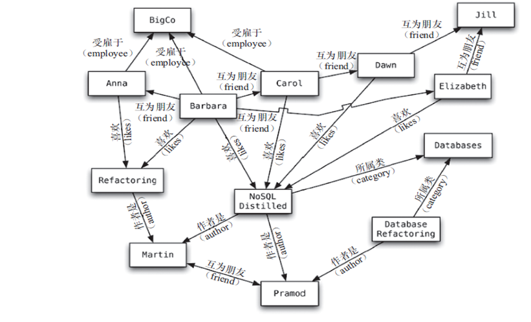
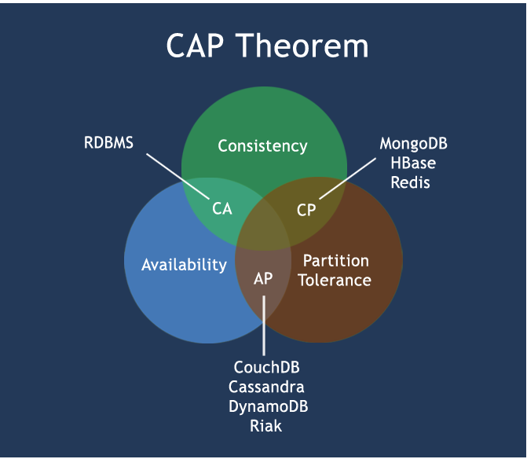

# Redis学习笔记 #

- [教学视频](https://www.bilibili.com/video/BV1oW411u75R)
- [Redis官网](https://redis.io/)
- [Redis中文网](http://www.redis.cn/)


-|-|-|-|-|-
---|---|---|---|---|---
[01.NoSQL入门概述-上](#01nosql%E5%85%A5%E9%97%A8%E6%A6%82%E8%BF%B0-%E4%B8%8A)|[02.NoSQL入门概述-下](#02nosql%E5%85%A5%E9%97%A8%E6%A6%82%E8%BF%B0-%E4%B8%8B)|[03.当下NoSQL应用场景简介](#03%E5%BD%93%E4%B8%8Bnosql%E5%BA%94%E7%94%A8%E5%9C%BA%E6%99%AF%E7%AE%80%E4%BB%8B)|[04.NoSQL数据模型简介](#04nosql%E6%95%B0%E6%8D%AE%E6%A8%A1%E5%9E%8B%E7%AE%80%E4%BB%8B)|[05.NoSQL数据库的四大分类](#05nosql%E6%95%B0%E6%8D%AE%E5%BA%93%E7%9A%84%E5%9B%9B%E5%A4%A7%E5%88%86%E7%B1%BB)|[06.分布式数据库CAP原理](#06%E5%88%86%E5%B8%83%E5%BC%8F%E6%95%B0%E6%8D%AE%E5%BA%93cap%E5%8E%9F%E7%90%86)
[07.安装](#07%E5%AE%89%E8%A3%85)|[08.HelloWorld](#08helloworld)|[09.启动后杂项基础知识](#09%E5%90%AF%E5%8A%A8%E5%90%8E%E6%9D%82%E9%A1%B9%E5%9F%BA%E7%A1%80%E7%9F%A5%E8%AF%86)|[10.常用五大数据类型简介](#10%E5%B8%B8%E7%94%A8%E4%BA%94%E5%A4%A7%E6%95%B0%E6%8D%AE%E7%B1%BB%E5%9E%8B%E7%AE%80%E4%BB%8B)|[11.Key关键字](#11key%E5%85%B3%E9%94%AE%E5%AD%97)|[12.String](#12string)
[13.List](#13list)|[14.Set](#14set)|[15.Hash](#15hash)|[16.ZSet](#16zset)|[17.配置文件介绍](#17%E9%85%8D%E7%BD%AE%E6%96%87%E4%BB%B6%E4%BB%8B%E7%BB%8D)|[18.持久化之RDB](#18%E6%8C%81%E4%B9%85%E5%8C%96%E4%B9%8Brdb)
[19.持久化之AOF](#19%E6%8C%81%E4%B9%85%E5%8C%96%E4%B9%8Baof)|[20.事务](#20%E4%BA%8B%E5%8A%A1)|[21.消息订阅发布简介](#21%E6%B6%88%E6%81%AF%E8%AE%A2%E9%98%85%E5%8F%91%E5%B8%83%E7%AE%80%E4%BB%8B)|[22&23.主从复制](#2223%E4%B8%BB%E4%BB%8E%E5%A4%8D%E5%88%B6)|[24.Jedis_测试联通](#24jedis_%E6%B5%8B%E8%AF%95%E8%81%94%E9%80%9A)|[25.Jedis_常用API](#25jedis_%E5%B8%B8%E7%94%A8api)
[26.Jedis_事务](#26jedis_%E4%BA%8B%E5%8A%A1)|[27.Jedis_主从复制](#27jedis_%E4%B8%BB%E4%BB%8E%E5%A4%8D%E5%88%B6)|[28.Jedis_JedisPool](#28jedis_jedispool)|[29.待学](#29%E5%BE%85%E5%AD%A6)|[旧笔记](Old%20Note)|-

## 01.NoSQL入门概述-上

### 1.互联网时代背景下大机遇，为什么用NoSQL

#### 1.单机MySQL的美好年代

在90年代，一个网站的访问量一般都不大，用单个数据库完全可以轻松应付。
在那个时候，更多的都是静态网页，动态交互类型的网站不多。


> DAL dal是数据访问层的英文缩写，即为数据访问层（Data Access Layer）

上述架构下，我们来看看数据存储的瓶颈是什么?
1. 数据量的总大小一个机器放不下时
2. 数据的索引(B+ Tree)一个机器的内存放不下时
3. 访问量(读写混合)一个实例不能承受

如果满足了上述1or3个，进化...

#### 2.Memcached(缓存)+MySQL+垂直拆分

后来，随着访问量的上升，几乎大部分使用MySQL架构的网站在数据库上都开始出现了性能问题，web程序不再仅仅专注在功能上，同时也在追求性能。程序员们开始大量的使用缓存技术来缓解数据库的压力，优化数据库的结构和索引。开始比较流行的是通过文件缓存来缓解数据库压力，但是当访问量继续增大的时候，多台web机器通过文件缓存不能共享，大量的小文件缓存也带了了比较高的IO压力。在这个时候，Memcached就自然的成为一个非常时尚的技术产品。


#### 3.Mysql主从读写分离

由于数据库的写入压力增加，Memcached 只能缓解数据库的读取压力。读写集中在一个数据库上让数据库不堪重负，大部分网站开始使用主从复制技术来达到读写分离，以提高读写性能和读库的可扩展性。Mysql的master-slave模 式成为这个时候的网站标配了。


#### 4.分表分库+水平拆分+mysql集群

在Memcached的高速缓存，MySQL的主从复制， 读写分离的基础之上，这时MySQL主库的写压力开始出现瓶颈，而数据量的持续猛增，由于MyISAM使用表锁，在高并发下会出现严重的锁问题，大量的高并发MySQL应用开始使用InnoDB引擎代替MyISAM。

同时，开始流行使用分表分库来缓解写压力和数据增长的扩展问题。这个时候，分表分库成了一个热门技术，是面试的热门问题也是业界讨论的热门技术问题。也就在这个时候，MySQL推出了还不太稳定的表分区，这也给技术实力一般的公司带来了希望。虽然MySQL推出了MySQL Cluster集群，但性能也不能很好满足互联网的要求，只是在高可靠性上提供了非常大的保证。


#### 5.MySQL的扩展性瓶颈

MySQL数据库也经常存储一些大文本字段，导致数据库表非常的大，在做数据库恢复的时候就导致非常的慢，不容易快速恢复数据库。比如1000万4KB大小的文本就接近40GB的大小， 如果能把这些数据从MySQL省去，MySQL将变得非常的小。关系数据库很强大，但是它并不能很好的应付所有的应用场景。MySQL的扩展性差(需要复杂的技术来实现)，大数据下IO压力大，表结构更改困难，正是当前使用MySOL的开发人员面临的问题。

#### 6.今天是什么样子? ?


#### 7.为什么用NoSQL

今天我们可以通过第三方平台( 如: Google，Facebook等) 可以很容易的访问和抓取数据。用户的个人信息，社交网络，地理位置，用户生成的数据和用户操作日志已经成倍的增加。我们如果要对这些用户数据进行挖掘，那SQL数据库已经不适合这些应用了，NoSQL数据库的发展也却能很好的处理这些大的数据。


### 2.是什么

NoSQL(NoSQL = Not Only SQL)，意即“不仅仅是SQL”，**泛指非关系型的数据库**。随着互联网web2.0网站的兴起，传统的关系数据库在应付web2.0网站，特别是超大规模和高并发的SNS类型的web2.0纯动态网站已经显得力不从心，暴露了很多难以克服的问题，而非关系型的数据库则由于其本身的特点得到了非常迅速的发展。NoSQL 数据库的产生就是为了解决大规模数据集合多重数据种类带来的挑战，尤其是大数据应用难题，包括超大规模数据的存储。

(例如谷歌或Facebook每天为他们的用户收集万亿比特的数据)。这些类型的数据存储不需要固定的模式，**无需多余操作就可以横向扩展**。

### 3.能干嘛

#### 易扩展

NoSQL数据库种类繁多，但是一个共同的特点都是去掉关系数据库的关系型特性。数据之间无关系，这样就非常容易扩展。也无形之间，在架构的层面上带来了可扩展的能力。

#### 大数据量高性能

NoSQL数据库都具有非常高的读写性能，尤其在大数据量下，同样表现优秀。

这得益于它的无关系性，数据库的结构简单。

一般MySQL使用Query Cache，每次表的更新Cache就失效，是一种大粒度的Cache，在针对web2.0的交互频繁的应用，Cache性能不高。

而NoSQL的Cache是记录级的，是一种细粒度的Cache，所以NoSQL在这个层面上来说就要性能高很多了。

#### 多样灵活的数据模型

NoSQL无需事先为要存储的数据建立字段，随时可以存储自定义的数据格式。

而在关系数据库里，增删字段是一件非常麻烦的事情。如果是非常大数据量的表，增加字段简直就是一个噩梦。

#### 传统RDBMS VS NOSQL

**RDBMS**

- 高度组织化结构化数据
- 结构化查询语言(SQL)
- 数据和关系都存储在单独的表中
- 数据操纵语言，数据定义语言
- 严格的一致性
- 基础事务

---

**NoSQL**

- 代表着不仅仅是SQL
- 没有声明性查询语言
- 没有预定义的模式
- 键-值对存储，列存储，文档存储，图形数据库
- 最终一致性，而非ACID属性
- 非结构化和不可预知的数据:
- CAP定理
- 高性能，高可用性和可伸缩性

### 4.有哪些NoSQL

- Redis
- Memcached
- MongDB

### 5.怎么玩

- KV
- Cache
- Persistence

## 02.NoSQL入门概述-下

### 3V + 3高

大数据时代的3V：

1. 海量Volume
2. 多样Variety
3. 实时Velocity

互联网需求的3高：

1. 高并发
2. 高可括
3. 高性能

## 03.当下NoSQL应用场景简介

**SQL和NoSQL双剑合璧**

### Alibaba中文站商品信息如何存放 ###

看看阿里巴巴中文网站首页以女装/女包包为例

架构发展历程：

1. 演变过程


2. 第5代


3. 第5代架构使命


---

**和我们相关的，多数据源类型的存储问题**


### 商品信息的存储方案 ###

1. 商品基本信息
	- 名称、价格，出厂日期，生产厂商等
	- 关系型数据库，mysql/oracle目前淘宝在去O化(也即拿掉Oracle)，注意，淘宝内部用的Mysql是里面的大牛自己改造过的
		- 为什么去IOE（在IT建设过程中，去除IBM小型机、Oracle数据库及EMC存储设备） 简而意之，可不用穿脚链跳舞。
2. 商品描述、详情、评价信息(多文字类)
	- 多文字信息描述类，IO读写性能变差
	- 文档数据库MongDB
3. 商品的图片
	- 商品图片展现类
	- 分布式的文件系统中
		- 淘宝自家TFS
		- Google的GFS
		- Hadoop的HDFS
4. 商品的关键字
	- 淘宝自家
	- ISearch
5. 商品的波段性的热点高频信息（如，情人节的巧克力）
	- 内存数据库
	- Tair、Redis、Memcache
6. 商品的交易、价格计算、积分累计
	- 外部系统，外部第3方支付接口
	- 支付宝

### 总结大型互联网应用(大数据、高并发、多样数据类型)的难点和解决方案 ###

- 难点
	- 数据类型多样性
	- 数据源多样性和变化重构
	- 数据源改造而数据服务平台不需要大面积重构
- 解决方法
	- EAI
	- UDSL 统一数据平台服务层 
		- 是什么 <br>
		- 什么样 <br>
			- 映射 <br>
			- API <br>
			- 热点缓存 <br>

## 04.NoSQL数据模型简介

以一个电商客户、订单、订购、地址模型来对比关系型数据库和非关系型数据库
- 传统关系型数据库如何设计
	- ER图（1：1、1：N、N：1）主外键等
	- NOSQL如何设计
		- BSON ()是一种类json的一种二进制形式的存储格式，简称Binary JSON，它和JSON一样，支持内嵌的文档对象和数组对象
	- 两者对比，问题和难点
		- 问题和难点
			- 为什么用聚合模型来处理
				- 高并发的操作是不太建议用关联查询的，互联网公司用冗余数据来避免关联查询
				- 分布式事务是支持不了太多的并发的

聚合模型

- KV
- BSON
- 列族
	- 顾名思义，是按列存储数据的。最大的特点是方便存储结构化和半结构化数据，方便做数据压缩，对针对某一 列或者某几列的查询有非常大的IO优势。
	- 
- 图形 <br>

## 05.NoSQL数据库的四大分类

- KV
	- 新浪：BerkeleyDB + Redis
	- 美团：Redis + tair
	- 阿里、百度：memcache + Redis 
- 文档型数据库（bson格式比较多）
	- CouchDB
	- MongoDB
		- MongoDB是一个基于分布式文件存储的数据库。由C++语言编写。旨在为WEB应用提供可扩展的高性能数据存储解决方案。
		- MongoDB是一个介于关系数据库和非关系数据库之间的产品，是非关系数据库当中功能最丰富，最像关系数据库的。
- 列存储数据库
	- Cassandra、HBase
	- 分布式文件系统
- 图关系数据库
	- 它不是放图形的、放的是关系比如：朋友圈社交网络、广告推荐系统
	- 社交网络、推荐系统。专注于构建关系图谱
	- Neo4j、InfoGrid
- 四者对比
	- 

## 06.分布式数据库CAP原理

### 传统的ACID分别是什么 ###

- A (Atomicity) 原子性
- C (Consistency) 一致性
- I (Isolation) 独立性
- D (Durability) 持久性

关系型数据库遵循ACID规则，事务在英文中是transaction，和现实世界中的交易很类似，它有如下四个特性：
 
**1、A (Atomicity) 原子性** 原子性很容易理解，也就是说事务里的所有操作要么全部做完，要么都不做，事务成功的条件是事务里的所有操作都成功，只要有一个操作失败，整个事务就失败，需要回滚。比如银行转账，从A账户转100元至B账户，分为两个步骤：1）从A账户取100元；2）存入100元至B账户。这两步要么一起完成，要么一起不完成，如果只完成第一步，第二步失败，钱会莫名其妙少了100元。
 
**2、C (Consistency) 一致性** 一致性也比较容易理解，也就是说数据库要一直处于一致的状态，事务的运行不会改变数据库原本的一致性约束。
 
**3、I (Isolation) 独立性** 所谓的独立性是指并发的事务之间不会互相影响，如果一个事务要访问的数据正在被另外一个事务修改，只要另外一个事务未提交，它所访问的数据就不受未提交事务的影响。比如现有有个交易是从A账户转100元至B账户，在这个交易还未完成的情况下，如果此时B查询自己的账户，是看不到新增加的100元的
 
**4、D (Durability) 持久性** 持久性是指一旦事务提交后，它所做的修改将会永久的保存在数据库上，即使出现宕机也不会丢失。


### CAP ###

- C:Consistency（强一致性）
- A:Availability（可用性）
- P:Partition tolerance（分区容错性）

CAP理论就是说在分布式存储系统中，最多只能实现上面的两点。

而由于当前的网络硬件肯定会出现延迟丢包等问题，所以**分区容忍性**是我们必须需要实现的。所以我们只能在**一致性**和**可用性**之间进行权衡，**没有**NoSQL系统能同时保证这三点。

- CA 传统Oracle数据库
- AP 大多数网站架构的选择
- CP Redis、Mongodb

注意：分布式架构的时候必须做出取舍。

一致性和可用性之间取一个平衡。多余大多数web应用，其实并不需要强一致性。因此牺牲C换取P，这是目前分布式数据库产品的方向。

---

**一致性与可用性的决择**
 
对于web2.0网站来说，关系数据库的很多主要特性却往往无用武之地

---

**数据库事务一致性需求**

很多web实时系统并不要求严格的数据库事务，对读一致性的要求很低， 有些场合对写一致性要求并不高。允许实现最终一致性。

---

**数据库的写实时性和读实时性需求**

对关系数据库来说，插入一条数据之后立刻查询，是肯定可以读出来这条数据的，但是对于很多web应用来说，并不要求这么高的实时性，比方说在微博发一条消息之后，过几秒乃至十几秒之后，我的订阅者才看到这条动态是完全可以接受的。
 
**对复杂的SQL查询，特别是多表关联查询的需求**

任何大数据量的web系统，都非常忌讳多个大表的关联查询，以及复杂的数据分析类型的报表查询，特别是SNS类型的网站，从需求以及产品设计角 度，就避免了这种情况的产生。往往更多的只是单表的主键查询，以及单表的简单条件分页查询，SQL的功能被极大的弱化了。

#### 经典CAP图 ####

CAP理论的核心是：一个分布式系统不可能同时很好的满足一致性，可用性和分区容错性这三个需求，**最多只能同时较好的满足两个**。

因此，根据 CAP 原理将 NoSQL 数据库分成了满足 CA 原则、满足 CP 原则和满足 AP 原则三 大类：

- CA - 单点集群，满足一致性，可用性的系统，通常在可扩展性上不太强大。
- CP - 满足一致性，分区容忍必的系统，通常性能不是特别高。
- AP - 满足可用性，分区容忍性的系统，通常可能对一致性要求低一些。



### BASE ###

BASE就是为了解决关系数据库强一致性引起的问题而引起的可用性降低而提出的解决方案。
 
BASE其实是下面三个术语的缩写：

- 基本可用（Basically Available）
- 软状态（Soft state）
- 最终一致（Eventually consistent）
 
它的思想是通过**让系统放松对某一时刻数据一致性的要求来换取系统整体伸缩性和性能上改观**。为什么这么说呢，缘由就在于大型系统往往由于地域分布和极高性能的要求，不可能采用分布式事务来完成这些指标，要想获得这些指标，我们必须采用另外一种方式来完成，这里BASE就是解决这个问题的办法

### 分布式+集群简介 ###

分布式系统（distributed system）

由多台计算机和通信的软件组件通过计算机网络连接（本地网络或广域网）组成。分布式系统是建立在网络之上的软件系统。正是因为软件的特性，所以分布式系统具有高度的内聚性和透明性。因此，网络和分布式系统之间的区别更多的在于高层软件（特别是操作系统），而不是硬件。分布式系统可以应用在在不同的平台上如：PC、工作站、局域网和广域网上等。

简单来讲：

1. 分布式：不同的多台服务器上面部署**不同**的服务模块（工程），他们之间通过Rpc/Rmi之间通信和调用，对外提供服务和组内协作。
2. 集群：不同的多台服务器上面部署**相同**的服务模块，通过分布式调度软件进行统一的调度，对外提供服务和访问。

## 07.安装

### 入门概述

#### 是什么 ####

Redis:REmote DIctionary Server(远程字典服务器)是完全开源免费的，用C语言编写的，遵守BSD协议，是一个高性能的(key/value)分布式内存数据库，基于内存运行 并支持持久化的NoSQL数据库，是当前最热门的NoSql数据库之一，也被人们称为数据结构服务器。

Redis 与其他 key - value 缓存产品有以下三个特点：

- Redis支持数据的持久化，可以将内存中的数据保持在磁盘中，重启的时候可以再次加载进行使用
- Redis不仅仅支持简单的key-value类型的数据，同时还提供list，set，zset，hash等数据结构的存储
- Redis支持数据的备份，即master-slave模式的数据备份

#### 能干嘛 ####

- 内存存储和持久化：redis支持异步将内存中的数据写到硬盘上，同时不影响继续服务
- 取最新N个数据的操作，如：可以将最新的10条评论的ID放在Redis的List集合里面
- 模拟类似于HttpSession这种需要设定过期时间的功能
- 发布、订阅消息系统
- 定时器、计数器

#### 去哪下 ####

- [Redis官网](https://redis.io/)
- [Redis中文网](http://www.redis.cn/)

#### 怎么玩 ####

- 数据类型、基本操作和配置
- 持久化和复制，RDB/AOF
- 事务的控制
- 复制（主从关系）

### Redis的安装 ###

#### Linux版安装 ####

略

#### Windows版安装 ####

[Redis X.X.X for Windows](https://github.com/tporadowski/redis/releases)

大多数企业是使用Linux的Redis，Windows仅供学习。

## 08.HelloWorld

1. 打开cmd
2. 输入`cd C:\Program Files\Redis-x64-3.2.100`，进入Redis的主目录
3. 输入`redis-server.exe redis.windows.conf`，打开Redis服务端
4. 另外打开cmd
5. 输入`cd C:\Program Files\Redis-x64-3.2.100`，进入Redis的主目录
6. 输入`redis-cli.exe -h 127.0.0.1 -p 6379`，打开Redis客户端
7. 在Redis客户端输入`set hello world`回车，再输入`get hello`回车便返回`world`。
8. 在Redis客户端输入`exit`回车、退出客户端。

```
C:\Program Files\Redis-x64-3.2.100>redis-cli.exe
127.0.0.1:6379> set hello world
OK
127.0.0.1:6379> get hello
"world"
127.0.0.1:6379>
```

## 09.启动后杂项基础知识

- `C:\Program Files\Redis-x64-3.2.100>redis-benchmark.exe` 测试redis在机器运行的效能
- 单进程
	- 单进程模型来处理客户端的请求。对读写等事件的响应 是通过对epoll函数的包装来做到的。Redis的实际处理速度完全依靠主进程的执行效率
	- Epoll是Linux内核为处理大批量文件描述符而作了改进的epoll，是Linux下多路复用IO接口select/poll的增强版本， 它能显著提高程序在大量并发连接中只有少量活跃的情况下的系统CPU利用率。
- 默认16个数据库，类似数组下表从零开始，初始默认使用零号库，可在配置文件配置
- `select`命令切换数据库
- `dbsize`查看当前数据库的key的数量
- `flushdb`：清空当前库
- `flushall`；通杀全部库
- 统一密码管理，16个库都是同样密码，要么都OK要么一个也连接不上
- Redis索引都是从零开始
- 为什么默认端口是6379

## 10.常用五大数据类型简介

### Redis的五大数据类型 ###

- String（字符串）
	- string是redis最基本的类型，你可以理解成与Memcached一模一样的类型，一个key对应一个value。
	- string类型是二进制安全的。意思是redis的string可以包含任何数据。比如jpg图片或者序列化的对象 。
	- string类型是Redis最基本的数据类型，一个redis中字符串value最多可以是512M
- Hash（哈希，类似java里的Map）
	- Redis hash 是一个键值对集合。
	- Redis hash是一个string类型的field和value的映射表，hash特别适合用于存储对象。
	- 类似Java里面的Map<String,Object>
- List（列表）
	- Redis 列表是简单的字符串列表，按照插入顺序排序。你可以添加一个元素导列表的头部（左边）或者尾部（右边）。
	- 它的底层实际是个链表
- Set（集合）
	- Redis的Set是string类型的无序集合。它是通过HashTable实现实现的
- Zset(sorted set：有序集合)
	- Redis zset 和 set 一样也是string类型元素的集合，且不允许重复的成员。
	- 不同的是每个元素都会关联一个double类型的分数。
	- redis正是通过分数来为集合中的成员进行从小到大的排序。zset的成员是唯一的，但分数(score)却可以重复。
- 哪里去获得redis常见数据类型操作命令
	- [Redis 命令参考](http://redisdoc.com/)
	- [Redis 官网命令参考](https://redis.io/commands)

## 11.Key关键字

### 常用的

命令|描述
---|---
DEL key|该命令用于在 key 存在时删除 key。
DUMP key|序列化给定 key ，并返回被序列化的值。
EXISTS key|检查给定 key 是否存在。
EXPIRE key seconds|为给定 key 设置过期时间，以秒计。
EXPIREAT key timestamp|EXPIREAT 的作用和 EXPIRE 类似，都用于为 key 设置过期时间。 不同在于 EXPIREAT 命令接受的时间参数是 UNIX 时间戳(unix timestamp)。
PEXPIRE key milliseconds|设置 key 的过期时间以毫秒计。
PEXPIREAT key milliseconds-timestamp|设置 key 过期时间的时间戳(unix timestamp) 以毫秒计
KEYS pattern|查找所有符合给定模式( pattern)的 key 。
MOVE key db|将当前数据库的 key 移动到给定的数据库 db 当中。
PERSIST key|移除 key 的过期时间，key 将持久保持。
PTTL key|以毫秒为单位返回 key 的剩余的过期时间。
TTL key|以秒为单位，返回给定 key 的剩余生存时间(TTL, time to live)。
RANDOMKEY|从当前数据库中随机返回一个 key 。
RENAME key newkey|修改 key 的名称
RENAMENX key newkey|仅当 newkey 不存在时，将 key 改名为 newkey 。
SCAN cursor [MATCH pattern] [COUNT count]|迭代数据库中的数据库键。
TYPE key|返回 key 所储存的值的类型。

#### 案例 ####

- keys *
- exists key的名字，判断某个key是否存在
- move key db   --->当前库就没有了，被移除了
- expire key 秒钟：为给定的key设置过期时间
- ttl key 查看还有多少秒过期，-1表示永不过期，-2表示已过期
- type key 查看你的key是什么类型

## 12.String

单值单value

### 常用 ###

命令|描述
---|---
SET key value|设置指定 key 的值
GET key|获取指定 key 的值。
GETRANGE key start end|返回 key 中字符串值的子字符
GETSET key value|将给定 key 的值设为 value ，并返回 key 的旧值(old value)。
GETBIT key offset|对 key 所储存的字符串值，获取指定偏移量上的位(bit)。
MGET key1 [key2..]|获取所有(一个或多个)给定 key 的值。
SETBIT key offset value|对 key 所储存的字符串值，设置或清除指定偏移量上的位(bit)。
SETEX key seconds value|将值 value 关联到 key ，并将 key 的过期时间设为 seconds (以秒为单位)。
SETNX key value|只有在 key 不存在时设置 key 的值。
SETRANGE key offset value|用 value 参数覆写给定 key 所储存的字符串值，从偏移量 offset 开始。
STRLEN key|返回 key 所储存的字符串值的长度。
MSET key value [key value ...]|同时设置一个或多个 key-value 对。
MSETNX key value [key value ...]|同时设置一个或多个 key-value 对，当且仅当所有给定 key 都不存在。
PSETEX key milliseconds value|这个命令和 SETEX 命令相似，但它以毫秒为单位设置 key 的生存时间，而不是像 SETEX 命令那样，以秒为单位。
INCR key|将 key 中储存的数字值增一。
INCRBY key increment|将 key 所储存的值加上给定的增量值（increment） 。
INCRBYFLOAT key increment|将 key 所储存的值加上给定的浮点增量值（increment） 。
DECR key|将 key 中储存的数字值减一。
DECRBY key decrement|key 所储存的值减去给定的减量值（decrement） 。
APPEND key value|如果 key 已经存在并且是一个字符串， APPEND 命令将指定的 value 追加到该 key 原来值（value）的末尾。

### 案例 ###

- set/get/del/append/strlen
- Incr/decr/incrby/decrby,一定要是数字才能进行加减
- getrange/setrange
- setex(set with expire)键秒值/setnx(set if not exist)
- mset/mget/msetnx
- getset(先get再set)

## 13.List

单值多value

### 常用 ###

命令|描述
---|---
BLPOP key1 [key2 ] timeout|移出并获取列表的第一个元素， 如果列表没有元素会阻塞列表直到等待超时或发现可弹出元素为止。
BRPOP key1 [key2 ] timeout|移出并获取列表的最后一个元素， 如果列表没有元素会阻塞列表直到等待超时或发现可弹出元素为止。
BRPOPLPUSH source destination timeout|从列表中弹出一个值，将弹出的元素插入到另外一个列表中并返回它； 如果列表没有元素会阻塞列表直到等待超时或发现可弹出元素为止。
LINDEX key index|通过索引获取列表中的元素
LINSERT key BEFORE/AFTER pivot value|在列表的元素前或者后插入元素
LLEN key|获取列表长度
LPOP key|移出并获取列表的第一个元素
LPUSH key value1 [value2]|将一个或多个值插入到列表头部
LPUSHX key value|将一个值插入到已存在的列表头部
LRANGE key start stop|获取列表指定范围内的元素
LREM key count value|移除列表元素
LSET key index value|通过索引设置列表元素的值
LTRIM key start stop|对一个列表进行修剪(trim)，就是说，让列表只保留指定区间内的元素，不在指定区间之内的元素都将被删除。
RPOP key|移除列表的最后一个元素，返回值为移除的元素。
RPOPLPUSH source destination|移除列表的最后一个元素，并将该元素添加到另一个列表并返回
RPUSH key value1 [value2]|在列表中添加一个或多个值
RPUSHX key value|为已存在的列表添加值

### 案例 ###

- lpush/rpush/lrange
- lpop/rpop
- lindex，按照索引下标获得元素(从上到下)
- llen
- lrem key 删N个value
- ltrim key 开始index 结束index，截取指定范围的值后再赋值给key
- rpoplpush 源列表 目的列表
- lset key index value
- linsert key  before/after 值1 值2

性能总结：

- 它是一个字符串链表，left、right都可以插入添加；
- 如果键不存在，创建新的链表；
- 如果键已存在，新增内容；
- 如果值全移除，对应的键也就消失了。
- 链表的操作无论是头和尾效率都极高，但假如是对中间元素进行操作，效率就很惨淡了。

## 14.Set

单值多value

### 常用 ###

命令|描述
---|---
SADD key member1 [member2]|向集合添加一个或多个成员
SCARD key|获取集合的成员数
SDIFF key1 [key2]|返回给定所有集合的差集
SDIFFSTORE destination key1 [key2]|返回给定所有集合的差集并存储在 destination 中
SINTER key1 [key2]|返回给定所有集合的交集
SINTERSTORE destination key1 [key2]|返回给定所有集合的交集并存储在 destination 中
SISMEMBER key member|判断 member 元素是否是集合 key 的成员
SMEMBERS key|返回集合中的所有成员
SMOVE source destination member|将 member 元素从 source 集合移动到 destination 集合
SPOP key|移除并返回集合中的一个随机元素
SRANDMEMBER key [count]|返回集合中一个或多个随机数
SREM key member1 [member2]|移除集合中一个或多个成员
SUNION key1 [key2]|返回所有给定集合的并集
SUNIONSTORE destination key1 [key2]|所有给定集合的并集存储在 destination 集合中
SSCAN key cursor [MATCH pattern] [COUNT count]|迭代集合中的元素

### 案例 ###

- sadd/smembers/sismember
- scard，获取集合里面的元素个数
- srem key value 删除集合中元素
- srandmember key 某个整数(随机出几个数)
- spop key 随机出栈
- smove key1 key2 在key1里某个值      作用是将key1里的某个值赋给key2
- 数学集合类
	- 差集：sdiff
	- 交集：sinter
	- 并集：sunion

## 15.Hash

KV模式不变，但V是一个键值对

### 常用 ###

命令|描述
---|---
HDEL key field1 [field2]|删除一个或多个哈希表字段
HEXISTS key field|查看哈希表 key 中，指定的字段是否存在。
HGET key field|获取存储在哈希表中指定字段的值。
HGETALL key|获取在哈希表中指定 key 的所有字段和值
HINCRBY key field increment|为哈希表 key 中的指定字段的整数值加上增量 increment 。
HINCRBYFLOAT key field increment|为哈希表 key 中的指定字段的浮点数值加上增量 increment 。
HKEYS key|获取所有哈希表中的字段
HLEN key|获取哈希表中字段的数量
HMGET key field1 [field2]|获取所有给定字段的值
HMSET key field1 value1 [field2 value2 ]|同时将多个 field-value (域-值)对设置到哈希表 key 中。
HSET key field value|将哈希表 key 中的字段 field 的值设为 value 。
HSETNX key field value|只有在字段 field 不存在时，设置哈希表字段的值。
HVALS key|获取哈希表中所有值。
HSCAN key cursor [MATCH pattern] [COUNT count]|迭代哈希表中的键值对。

### 案例 ###

- hset/hget/hmset/hmget/hgetall/hdel
- hlen
- hexists key 在key里面的某个值的key
- hkeys/hvals
- hincrby/hincrbyfloat
- hsetnx

## 16.ZSet

在set基础上，加一个score值。 之前set是k1 v1 v2 v3， 现在zset是k1 score1 v1 score2 v2

### 常用 ###

命令|描述
---|---
ZADD key score1 member1 [score2 member2]|向有序集合添加一个或多个成员，或者更新已存在成员的分数
ZCARD key|获取有序集合的成员数
ZCOUNT key min max|计算在有序集合中指定区间分数的成员数
ZINCRBY key increment member|有序集合中对指定成员的分数加上增量 increment
ZINTERSTORE destination numkeys key [key ...]|计算给定的一个或多个有序集的交集并将结果集存储在新的有序集合 key 中
ZLEXCOUNT key min max|在有序集合中计算指定字典区间内成员数量
ZRANGE key start stop [WITHSCORES]|通过索引区间返回有序集合指定区间内的成员
ZRANGEBYLEX key min max [LIMIT offset count]|通过字典区间返回有序集合的成员
ZRANGEBYSCORE key min max [WITHSCORES] [LIMIT]|通过分数返回有序集合指定区间内的成员
ZRANK key member|返回有序集合中指定成员的索引
ZREM key member [member ...]|移除有序集合中的一个或多个成员
ZREMRANGEBYLEX key min max|移除有序集合中给定的字典区间的所有成员
ZREMRANGEBYRANK key start stop|移除有序集合中给定的排名区间的所有成员
ZREMRANGEBYSCORE key min max|移除有序集合中给定的分数区间的所有成员
ZREVRANGE key start stop [WITHSCORES]|返回有序集中指定区间内的成员，通过索引，分数从高到低
ZREVRANGEBYSCORE key max min [WITHSCORES]|返回有序集中指定分数区间内的成员，分数从高到低排序
ZREVRANK key member|返回有序集合中指定成员的排名，有序集成员按分数值递减(从大到小)排序
ZSCORE key member|返回有序集中，成员的分数值
ZUNIONSTORE destination numkeys key [key ...]|计算给定的一个或多个有序集的并集，并存储在新的 key 中
ZSCAN key cursor [MATCH pattern] [COUNT count]|迭代有序集合中的元素（包括元素成员和元素分值）

### 案例 ###

- zadd/zrange
	- Withscores
- zrangebyscore key 开始score 结束score
	- withscores
	- (   不包含
	- Limit 作用是返回限制
		- limit 开始下标步 多少步
- zrem key 某score下对应的value值，作用是删除元素
- zcard/zcount key score区间/zrank key values值，作用是获得下标值/zscore key 对应值,获得分数
- zrevrank key values值，作用是逆序获得下标值
- zrevrange
- zrevrangebyscore  key 结束score 开始score

## 17.配置文件介绍

Redis 的配置文件位于 Redis 安装目录下，文件名为 redis.conf(Windows 名为 redis.windows.conf)。

你可以通过 CONFIG 命令查看或设置配置项。

**语法**

`Redis CONFIG` 命令格式如下：

	redis 127.0.0.1:6379> CONFIG GET CONFIG_SETTING_NAME

**实例**

	redis 127.0.0.1:6379> CONFIG GET loglevel

	1) "loglevel"
	2) "notice"

### 参数说明 ###

redis.conf 配置项说明如下：

**注意**，下面配置项说明并不全，了解更多请检阅redis.conf。

序号|配置项|说明
---|---|---
1|`daemonize no`|Redis 默认不是以守护进程的方式运行，可以通过该配置项修改，使用 yes 启用守护进程（Windows 不支持守护线程的配置为 no ）
2|`pidfile /var/run/redis.pid`|当 Redis 以守护进程方式运行时，Redis 默认会把 pid 写入 /var/run/redis.pid 文件，可以通过 pidfile 指定
3|`port 6379`|指定 Redis 监听端口，默认端口为 6379，作者在自己的一篇博文中解释了为什么选用 6379 作为默认端口，因为 6379 在手机按键上 MERZ 对应的号码，而 MERZ 取自意大利歌女 Alessia Merz 的名字
4|`bind 127.0.0.1`|绑定的主机地址
5|`timeout 300`|当客户端闲置多长秒后关闭连接，如果指定为 0 ，表示关闭该功能
6|`loglevel notice`|指定日志记录级别，Redis 总共支持四个级别：debug、verbose、notice、warning，默认为 notice
7|`logfile stdout`|日志记录方式，默认为标准输出，如果配置 Redis 为守护进程方式运行，而这里又配置为日志记录方式为标准输出，则日志将会发送给 /dev/null
8|`databases 16`|设置数据库的数量，默认数据库为0，可以使用SELECT 命令在连接上指定数据库id
9|`save <seconds> <changes>`<br>Redis 默认配置文件中提供了三个条件：<br>`save 900 1`<br>`save 300 10`<br>`save 60 10000`<br>|分别表示 900 秒（15 分钟）内有 1 个更改，300 秒（5 分钟）内有 10 个更改以及 60 秒内有 10000 个更改。<br>指定在多长时间内，有多少次更新操作，就将数据同步到数据文件，可以多个条件配合
10|`rdbcompression yes`|指定存储至本地数据库时是否压缩数据，默认为 yes，Redis 采用 LZF 压缩，如果为了节省 CPU 时间，可以关闭该选项，但会导致数据库文件变的巨大
11|`dbfilename dump.rdb`|指定本地数据库文件名，默认值为 dump.rdb
12|`dir ./`|指定本地数据库存放目录
13|`slaveof <masterip> <masterport>`|设置当本机为 slave 服务时，设置 master 服务的 IP 地址及端口，在 Redis 启动时，它会自动从 master 进行数据同步
14|`masterauth <master-password>`|当 master 服务设置了密码保护时，slav 服务连接 master 的密码
15|`requirepass foobared`|设置 Redis 连接密码，如果配置了连接密码，客户端在连接 Redis 时需要通过 AUTH <password> 命令提供密码，默认关闭
16|`maxclients 128`|设置同一时间最大客户端连接数，默认无限制，Redis 可以同时打开的客户端连接数为 Redis 进程可以打开的最大文件描述符数，如果设置 maxclients 0，表示不作限制。当客户端连接数到达限制时，Redis 会关闭新的连接并向客户端返回 max number of clients reached 错误信息
17|`maxmemory <bytes>`|指定 Redis 最大内存限制，Redis 在启动时会把数据加载到内存中，达到最大内存后，Redis 会先尝试清除已到期或即将到期的 Key，当此方法处理 后，仍然到达最大内存设置，将无法再进行写入操作，但仍然可以进行读取操作。Redis 新的 vm 机制，会把 Key 存放内存，Value 会存放在 swap 区
18|`appendonly no`|指定是否在每次更新操作后进行日志记录，Redis 在默认情况下是异步的把数据写入磁盘，如果不开启，可能会在断电时导致一段时间内的数据丢失。因为 redis 本身同步数据文件是按上面 save 条件来同步的，所以有的数据会在一段时间内只存在于内存中。默认为 no
19|`appendfilename appendonly.aof`|指定更新日志文件名，默认为 appendonly.aof
20|`appendfsync everysec`|指定更新日志条件，共有 3 个可选值：<br>no：表示等操作系统进行数据缓存同步到磁盘（快）<br>always：表示每次更新操作后手动调用 fsync() 将数据写到磁盘（慢，安全）<br>everysec：表示每秒同步一次（折中，默认值）<br>
21|`vm-enabled no`|指定是否启用虚拟内存机制，默认值为 no，简单的介绍一下，VM 机制将数据分页存放，由 Redis 将访问量较少的页即冷数据 swap 到磁盘上，访问多的页面由磁盘自动换出到内存中（在后面的文章我会仔细分析 Redis 的 VM 机制）
22|`vm-swap-file /tmp/redis.swap`|虚拟内存文件路径，默认值为 /tmp/redis.swap，不可多个 Redis 实例共享
23|`vm-max-memory 0`|将所有大于 vm-max-memory 的数据存入虚拟内存，无论 vm-max-memory 设置多小，所有索引数据都是内存存储的(Redis 的索引数据 就是 keys)，也就是说，当 vm-max-memory 设置为 0 的时候，其实是所有 value 都存在于磁盘。默认值为 0
24|`vm-page-size 32`|Redis swap 文件分成了很多的 page，一个对象可以保存在多个 page 上面，但一个 page 上不能被多个对象共享，vm-page-size 是要根据存储的 数据大小来设定的，作者建议如果存储很多小对象，page 大小最好设置为 32 或者 64bytes；如果存储很大大对象，则可以使用更大的 page，如果不确定，就使用默认值
25|`vm-pages 134217728`|设置 swap 文件中的 page 数量，由于页表（一种表示页面空闲或使用的 bitmap）是在放在内存中的，，在磁盘上每 8 个 pages 将消耗 1byte 的内存。
26|`vm-max-threads 4`|设置访问swap文件的线程数,最好不要超过机器的核数,如果设置为0,那么所有对swap文件的操作都是串行的，可能会造成比较长时间的延迟。默认值为4
27|`glueoutputbuf yes`|设置在向客户端应答时，是否把较小的包合并为一个包发送，默认为开启
28|`hash-max-zipmap-entries 64`<br>`hash-max-zipmap-value 512`|指定在超过一定的数量或者最大的元素超过某一临界值时，采用一种特殊的哈希算法
29|`activerehashing yes`|指定是否激活重置哈希，默认为开启（后面在介绍 Redis 的哈希算法时具体介绍）
30|`include /path/to/local.conf`|指定包含其它的配置文件，可以在同一主机上多个Redis实例之间使用同一份配置文件，而同时各个实例又拥有自己的特定配置文件

## 18.持久化之RDB

RDB（Redis DataBase）

### 是什么 ###

- 在指定的时间间隔内将内存中的数据集快照写入磁盘，也就是行话讲的Snapshot快照，它恢复时是将快照文件直接读到内存里
- Redis会单独创建（fork）一个子进程来进行持久化，会先将数据写入到 一个临时文件中，待持久化过程都结束了，再用这个临时文件替换上次持久化好的文件。 整个过程中，主进程是不进行任何IO操作的，这就确保了极高的性能。如果需要进行大规模数据的恢复，且对于数据恢复的完整性不是非常敏感，那RDB方式要比AOF方式更加的高效。RDB的缺点是最后一次持久化后的数据可能丢失。

> Fork
> 
> Fork的作用是复制一个与当前进程一样的进程。新进程的所有数据（变量、环境变量、程序计数器等） 数值都和原进程一致，但是是一个全新的进程，并作为原进程的子进程

- rdb 保存的是dump.rdb文件
- 相关配置在配置文件的位置 - 在redis.conf搜寻`### SNAPSHOTTING  ###`

### 如何触发RDB快照 ###

- 配置文件中默认的快照配置`dbfilename dump.rdb`
	- 冷拷贝后重新使用
		- 可以cp dump.rdb dump_new.rdb
- 命令save或者是bgsave
	- Save：save时只管保存，其它不管，全部阻塞
	- BGSAVE：Redis会在后台异步进行快照操作， 快照同时还可以响应客户端请求。可以通过lastsave 命令获取最后一次成功执行快照的时间
- 执行flushall命令，也会产生dump.rdb文件，但里面是空的，无意义

### 如何恢复 ###

- 将备份文件 (dump.rdb) 移动到 redis 安装目录并启动服务即可
- `CONFIG GET dir`获取目录

### 优势与劣势 ###

- 优势
	- 适合大规模的数据恢复
	- 对数据完整性和一致性要求不高
- 劣势
	- 在一定间隔时间做一次备份，所以如果redis意外down掉的话，就 会丢失最后一次快照后的所有修改
	- Fork的时候，内存中的数据被克隆了一份，大致2倍的膨胀性需要考虑

### 如何停止 ###

动态所有停止RDB保存规则的方法：`redis-cli config set save ""`

### 小结 ###


- RDB是一个非常紧凑的文件。
- RDB在保存RDB文件时父进程唯一需要做的就是fork出一个子进程，接下来的工作全部由子进程来做，父进程不需要再做其他I0操作，所以RDB持久化方式可以最大化redis的性能。
- 与AOF相比，在恢复大的数据集的时候，RDB方式会更快一一些。
- 数据丢失风险大。
- RDB需要经常fork子进程来保存数据集到硬盘上，当数据集比较大的时候fork的过程是非常耗时的吗，可能会导致Redis在一些毫秒级不能回应客户端请求。

## 19.持久化之AOF

AOF（Append Only File）

### 是什么 ###

以日志的形式来记录每个写操作，将Redis执行过的所有写指令记录下来(读操作不记录)， 只许追加文件但不可以改写文件，redis启动之初会读取该文件重新构建数据，换言之，redis 重启的话就根据日志文件的内容将写指令从前到后执行一次以完成数据的恢复工作

### AOF配置 ###

- 相关配置在配置文件的位置 - 在redis.conf搜寻`### APPEND ONLY MODE ###`
- aof保存的是appendonly.aof文件（在配置文件可修改文件名）

### AOF启动/修复/恢复 ###

- 正常恢复
	- 启动：设置Yes
		- 修改默认的appendonly no，改为yes
	- 将有数据的aof文件复制一份保存到对应目录(config get dir)
	- 恢复：重启redis然后重新加载
- 异常恢复
	- 启动：设置Yes
		- 修改默认的appendonly no，改为yes
	- 备份被写坏的AOF文件
	- 修复：
		- Redis-check-aof --fix进行修复
	- 恢复：重启redis然后重新加载

### rewrite ###

- 是什么：
    - AOF采用文件追加方式，文件会越来越大。为避免出现此种情况，新增了重写机制， 当AOF文件的大小超过所设定的阈值时，Redis就会启动AOF文件的内容压缩， 只保留可以恢复数据的最小指令集。可以使用命令bgrewriteaof
- 重写原理
    - AOF文件持续增长而过大时，会fork出一条新进程来将文件重写(也是先写临时文件最后再rename)， 遍历新进程的内存中数据，每条记录有一条的Set语句。重写aof文件的操作，并没有读取旧的aof文件， 而是将整个内存中的数据库内容用命令的方式重写了一个新的aof文件，这点和快照有点类似
- 触发机制
    - Redis会记录上次重写时的AOF大小，默认配置是当AOF文件大小是上次rewrite后大小的一倍且文件大于64M时触发

### 优势与劣势 ###

- 优势
	- 每修改同步：appendfsync always   同步持久化 每次发生数据变更会被立即记录到磁盘  性能较差但数据完整性比较好
	- 每秒同步：appendfsync everysec    异步操作，每秒记录   如果一秒内宕机，有数据丢失
	- 不同步：appendfsync no   从不同步
- 劣势
	- 相同数据集的数据而言aof文件要远大于rdb文件，恢复速度慢于rdb
	- Aof运行效率要慢于rdb,每秒同步策略效率较好，不同步效率和rdb相同

### 小结 ###


- AOF文件时一个只进行追加的日志文件
- Redis可以在AOF文件体积变得过大时，自动地在后台对AOF进行重写
- AOF文件有序地保存了对数据库执行的所有写入操作，这些写入操作以Redis协议的格式保存，因此AOF文件的内容非常容易被人读懂，对文件进行分析也很轻松
- 对于相同的数据集来说，AOF文件的体积通常要大于RDB文件的体积
- 根据所使用的fsync 策略，AOF的速度可能会慢于RDB

## 20.事务

### 是什么 ###

可以一次执行多个命令，本质是一组命令的集合。一个事务中的所有命令都会序列化，按顺序地串行化执行而不会被其它命令插入，不许加塞。

### 能干嘛 ###

一个队列中，一次性、顺序性、排他性的执行一系列命令。

### 怎么玩 ###

#### 常用命令 ####

命令|描述
---|---
DISCARD|取消事务，放弃执行事务块内的所有命令。
EXEC|执行所有事务块内的命令。
MULTI|标记一个事务块的开始。
UNWATCH|取消 WATCH 命令对所有 key 的监视。
WATCH key [key ...]|监视一个(或多个) key ，如果在事务执行之前这个(或这些) key 被其他命令所改动，那么事务将被打断。

#### Case ####

##### 正常执行


##### 放弃事务


##### 全体连坐


类似Java编译异常

##### 冤头债主


类似Java运行异常

##### watch监控


###### 悲观锁/乐观锁/CAS(Check And Set)

- 悲观锁
	- 悲观锁(Pessimistic Lock), 顾名思义，就是很悲观，每次去拿数据的时候都认为别人会修改，所以每次在拿数据的时候都会上锁，这样别人想拿这个数据就会block直到它拿到锁。传统的关系型数据库里边就用到了很多这种锁机制，比如行锁，表锁等，读锁，写锁等，都是在做操作之前先上锁。
- 乐观锁
	- 乐观锁(Optimistic Lock), 顾名思义，就是很乐观，每次去拿数据的时候都认为别人不会修改，所以不会上锁，但是在更新的时候会判断一下在此期间别人有没有去更新这个数据，可以使用版本号等机制。乐观锁适用于多读的应用类型，这样可以提高吞吐量。
	- 乐观锁策略:提交版本必须大于记录当前版本才能执行更新
- CAS

###### 信用卡可用余额和欠额

- 初始化信用卡可用余额和欠额


- 无加塞篡改，先监控再开启multi， 保证两笔金额变动在同一个事务内


- 有加塞篡改
	- 监控了key，**如果key被修改了**，后面一个事务的执行失效


- unwatch


- 一旦执行了exec之前加的监控锁都会被取消掉了（一次性）

###### 小结

- Watch指令，类似乐观锁，事务提交时，如果Key的值已被别的客户端改变， 比如某个list已被别的客户端push/pop过了，整个事务队列都不会被执行
- 通过WATCH命令在事务执行之前监控了多个Keys，倘若在WATCH之后有任何Key的值发生了变化， EXEC命令执行的事务都将被放弃，同时返回Nullmulti-bulk应答以通知调用者事务执行失败

### 3阶段

- 开启：以MULTI开始一个事务
- 入队：将多个命令入队到事务中，接到这些命令并不会立即执行，而是放到等待执行的事务队列里面
- 执行：由EXEC命令触发事务

### 3特性

- **单独的隔离操作**：事务中的所有命令都会序列化、按顺序地执行。事务在执行的过程中，不会被其他客户端发送来的命令请求所打断。
- **没有隔离级别的概念**：队列中的命令没有提交之前都不会实际的被执行，因为事务提交前任何指令都不会被实际执行， 也就不存在”事务内的查询要看到事务里的更新，在事务外查询不能看到”这个让人万分头痛的问题
- **不保证原子性**：redis同一个事务中如果有一条命令执行失败，其后的命令仍然会被执行，没有回滚

不遵循传统的ACID中的AI

## 21.消息订阅发布简介

**用观察者模式理解学习**

进程间的一种消息通信模式：发送者(pub)发送消息，订阅者(sub)接收消息。

下图展示了频道 channel1 ， 以及订阅这个频道的三个客户端 —— client2 、 client5 和 client1 之间的关系：


当有新消息通过 PUBLISH 命令发送给频道 channel1 时， 这个消息就会被发送给订阅它的三个客户端：


### 常用命令 ###

命令|描述
---|---
PSUBSCRIBE pattern [pattern ...]|订阅一个或多个符合给定模式的频道。
PUBSUB subcommand [argument [argument ...]]|查看订阅与发布系统状态。
PUBLISH channel message|将信息发送到指定的频道。
PUNSUBSCRIBE [pattern [pattern ...]]|退订所有给定模式的频道。
SUBSCRIBE channel [channel ...]|订阅给定的一个或多个频道的信息。
UNSUBSCRIBE [channel [channel ...]]|指退订给定的频道。

### 实例 ###

以下实例演示了发布订阅是如何工作的。在我们实例中我们创建了订阅频道名为 redisChat:

```
redis 127.0.0.1:6379> SUBSCRIBE redisChat

Reading messages... (press Ctrl-C to quit)
1) "subscribe"
2) "redisChat"
3) (integer) 1
```

现在，我们先重新开启个 redis 客户端，然后在同一个频道 redisChat 发布两次消息，订阅者就能接收到消息。


```
redis 127.0.0.1:6379> PUBLISH redisChat "Redis is a great caching technique"

(integer) 1

redis 127.0.0.1:6379> PUBLISH redisChat "Learn redis by runoob.com"

(integer) 1

# 订阅者的客户端会显示如下消息
1) "message"
2) "redisChat"
3) "Redis is a great caching technique"
1) "message"
2) "redisChat"
3) "Learn redis by runoob.com"
```

---

订阅多个通配符 \* 

	PSUBSCRIBE new*

收取消息， 

	PUBLISH new1 redis2015

## 22&23.主从复制

[22.](#)

### 是什么 ###

行话：也就是我们所说的主从复制，主机数据更新后根据配置和策略， 自动同步到备机的master/slaver机制，Master以写为主，Slave以读为主

### 能干嘛 ###

- 读写分离
- 容灾恢复

### 怎么玩 ###

#### 准备工作 ####

- 配从(库)不配主(库)
- 从库配置命令：`slaveof 主库IP 主库端口`
	- 每次与master断开之后，都需要重新连接，除非你配置进redis.conf文件（具体位置：redis.conf搜寻`#### REPLICATION ####`）
	- `info replication`
- 修改配置文件细节操作
	- 拷贝多个redis.conf文件，按'redis[port].conf'重命名
	- 开启daemonize yes
	- pid文件名字
	- 指定端口
	- log文件名字
	- dump.rdb名字

> replication
> 英 [ˌreplɪ'keɪʃ(ə)n]   美 [ˌreplɪ'keɪʃ(ə)n]  
> n.
> (绘画等的)复制;拷贝;重复(实验);(尤指对答辩的)回答

#### 常用3招 ####


##### 一主二仆 #####

- Init 
- 一个Master两个Slave 
- 日志查看
	- 主机日志 
	- 备机日志 
	- `info replication` 
- 主从问题演示
	1. 切入点问题？slave1、slave2是从头开始复制还是从切入点开始复制?比如从k4进来，那之前的123是否也可以复制？
		- 答：从头开始复制；123也可以复制
	2. 从机是否可以写？set可否？
		- 答：从机不可写，不可set，主机可写
	3. 主机shutdown后情况如何？从机是上位还是原地待命
		- 答：从机还是原地待命（咸鱼翻身，还是咸鱼）
	4. 主机又回来了后，主机新增记录，从机还能否顺利复制？
		- 答：能
	5. 其中一台从机down后情况如何？依照原有它能跟上大部队吗？
		- 答：不能跟上，每次与master断开之后，都需要重新连接，除非你配置进redis.conf文件（具体位置：redis.conf搜寻`#### REPLICATION ####`）

[23.](#)

##### 薪火相传 #####

- 上一个Slave可以是下一个slave的Master，Slave同样可以接收其他 slaves的连接和同步请求，那么该slave作为了链条中下一个的master, 可以有效减轻master的写压力（奴隶的奴隶还是奴隶）
- 中途变更转向：会清除之前的数据，重新建立拷贝最新的
- `slaveof 新主库IP 新主库端口`

##### 反客为主 #####

- `SLAVEOF no one`
	- 使当前数据库停止与其他数据库的同步，转成主数据库

### 复制原理 ###

- slave启动成功连接到master后会发送一个sync命令
- master接到命令启动后台的存盘进程，同时收集所有接收到的用于修改数据集命令， 在后台进程执行完毕之后，master将传送整个数据文件到slave,以完成一次完全同步
- 全量复制：而slave服务在接收到数据库文件数据后，将其存盘并加载到内存中。
- 增量复制：Master继续将新的所有收集到的修改命令依次传给slave,完成同步
- 但是只要是重新连接master，一次完全同步（全量复制)将被自动执行

### 哨兵模式(sentinel) ###

一组sentinel能同时监控多个master

#### 是什么 ####

反客为主的自动版，能够后台监控主机是否故障，如果故障了根据投票数自动将从库转换为主库

#### 怎么玩(使用步骤) ####

1. 调整结构，6379带着6380、6381
2. 新建sentinel.conf文件，名字绝不能错
3. 配置哨兵,填写内容
	1. `sentinel monitor 被监控数据库名字(自己起名字) 127.0.0.1 6379 1`
	2. 上面最后一个数字1，表示主机挂掉后salve投票看让谁接替成为主机，得票数多少后成为主机（PS. 跟官网的描述有出入，下面有官方文档说明）
4. 启动哨兵
	1. `redis-sentinel /sentinel.conf `（上述目录依照各自的实际情况配置，可能目录不同）
5. 正常主从演示
6. 原有的master挂了
7. 投票新选
8. 重新主从继续开工，info replication查查看

问题：如果之前挂了的master重启回来，会不会双master冲突？
答： 不会，原master，变成slave


> `sentinel monitor <master-group-name> <ip> <port> <quorum>`
> 
> For the sake of clarity, let's check line by line what the configuration options mean:
> 
> The first line is used to tell Redis to monitor a master called mymaster, that is at address 127.0.0.1 and port 6379, with a quorum of 2. Everything is pretty obvious but the **quorum** argument:
> 
> - The **quorum** is the number of Sentinels that need to agree about the fact the master is not reachable, in order to really mark the master as failing, and eventually start a failover procedure if possible.
> - However **the quorum is only used to detect the failure**. In order to actually perform a failover, one of the Sentinels need to be elected leader for the failover and be authorized to proceed. This only happens with the vote of the **majority of the Sentinel processes**.
> 
> So for example if you have 5 Sentinel processes, and the quorum for a given master set to the value of 2, this is what happens:
> 
> - If two Sentinels agree at the same time about the master being unreachable, one of the two will try to start a failover.
> - If there are at least a total of three Sentinels reachable, the failover will be authorized and will actually start.
> 
> In practical terms this means during failures **Sentinel never starts a failover if the majority of Sentinel processes are unable to talk** (aka no failover in the minority partition).
>
>[Source](https://redis.io/topics/sentinel/)


> quorum
> 英 [ˈkwɔːrəm]   美 [ˈkwɔːrəm]  
> n.
> (会议的)法定人数


### 复制的缺点 ###

**复制延时**

由于所有的写操作都是先在Master上操作，然后同步更新到slave上，所以从Master同步到Slave机器有一定的延迟，当系统很繁忙的时候，延迟问题会更加严重，Slave机器数量的增加也会使这个问题更加严重。

## 24.Jedis_测试联通

- 在Eclipse创建普通Maven工程
- [pom.xml](pom.xml)引入下面关键依赖

```xml
<dependency>
	<groupId>redis.clients</groupId>
	<artifactId>jedis</artifactId>
	<version>2.1.0</version>
</dependency>
```

- 创建新类，测试连通，源码如下：

[TestPing.java](src/main/java/com/xhc/redis/redis/shang/TestPing.java)

```java
package com.xhc.shang;

import redis.clients.jedis.Jedis;

public class TestPing {
	public static void main(String[] args) 
	{
		Jedis jedis = new Jedis("127.0.0.1",6379);
		//输出PONG，redis连通成功
		System.out.println(jedis.ping());
	}
}

```

## 25.Jedis_常用API

[TestAPI.java](src/main/java/com/xhc/redis/redis/shang/TestAPI.java)

```java
import java.util.HashMap;
import java.util.Iterator;
import java.util.List;
import java.util.Map;
import java.util.Set;

import redis.clients.jedis.Jedis;

public class TestAPI {
	public static void main(String[] args) {

		Jedis jedis = new Jedis("127.0.0.1", 6379);
		// key
		Set<String> keys = jedis.keys("*");
		for (Iterator iterator = keys.iterator(); iterator.hasNext();) {
			String key = (String) iterator.next();
			System.out.println(key);
		}
		System.out.println("jedis.exists====>" + jedis.exists("k2"));
		System.out.println(jedis.ttl("k1"));
		
		// String
		// jedis.append("k1","myreids");
		System.out.println(jedis.get("k1"));
		jedis.set("k4", "k4_redis");
		System.out.println("----------------------------------------");
		jedis.mset("str1", "v1", "str2", "v2", "str3", "v3");
		System.out.println(jedis.mget("str1", "str2", "str3"));
		
		
		// list
		System.out.println("----------------------------------------");
		// jedis.lpush("mylist","v1","v2","v3","v4","v5");
		List<String> list = jedis.lrange("mylist", 0, -1);
		for (String element : list) {
			System.out.println(element);
		}
		
		// set
		jedis.sadd("orders", "jd001");
		jedis.sadd("orders", "jd002");
		jedis.sadd("orders", "jd003");
		Set<String> set1 = jedis.smembers("orders");
		for (Iterator iterator = set1.iterator(); iterator.hasNext();) {
			String string = (String) iterator.next();
			System.out.println(string);
		}
		jedis.srem("orders", "jd002");
		System.out.println(jedis.smembers("orders").size());
		
		// hash
		jedis.hset("hash1", "userName", "lisi");
		System.out.println(jedis.hget("hash1", "userName"));
		Map<String, String> map = new HashMap<String, String>();
		map.put("telphone", "13811814763");
		map.put("address", "atguigu");
		map.put("email", "abc@163.com");
		jedis.hmset("hash2", map);
		List<String> result = jedis.hmget("hash2", "telphone", "email");
		for (String element : result) {
			System.out.println(element);
		}
		
		// zset
		jedis.zadd("zset01", 60d, "v1");
		jedis.zadd("zset01", 70d, "v2");
		jedis.zadd("zset01", 80d, "v3");
		jedis.zadd("zset01", 90d, "v4");

		Set<String> s1 = jedis.zrange("zset01", 0, -1);
		for (Iterator iterator = s1.iterator(); iterator.hasNext();) {
			String string = (String) iterator.next();
			System.out.println(string);
		}

	}
}

```

## 26.Jedis_事务

### 日常 ###

```java

import redis.clients.jedis.Jedis;
import redis.clients.jedis.Response;
import redis.clients.jedis.Transaction;

public class Test03 {
	public static void main(String[] args) {
		Jedis jedis = new Jedis("127.0.0.1", 6379);

		// 监控key，如果该动了事务就被放弃
		/*
		 * 3 jedis.watch("serialNum"); jedis.set("serialNum","s#####################");
		 * jedis.unwatch();
		 */

		Transaction transaction = jedis.multi();// 被当作一个命令进行执行
		Response<String> response = transaction.get("serialNum");
		transaction.set("serialNum", "s002");
		response = transaction.get("serialNum");
		transaction.lpush("list3", "a");
		transaction.lpush("list3", "b");
		transaction.lpush("list3", "c");

		transaction.exec();
		// 2 transaction.discard();
		System.out.println("serialNum***********" + response.get());

	}
}

```

### 加锁 ###

[TestTX.java](src/main/java/com/xhc/redis/redis/shang/TestTX.java)

```java
import redis.clients.jedis.Jedis;
import redis.clients.jedis.Transaction;

public class TestTX {
	public boolean transMethod() throws InterruptedException {
		Jedis jedis = new Jedis("127.0.0.1", 6379);
		int balance;// 可用余额
		int debt;// 欠额
		int amtToSubtract = 10;// 实刷额度

		jedis.watch("balance");
		// jedis.set("balance","5");//此句不该出现，讲课方便。模拟其他程序已经修改了该条目
		Thread.sleep(7000);
		balance = Integer.parseInt(jedis.get("balance"));
		if (balance < amtToSubtract) {
			jedis.unwatch();
			System.out.println("modify");
			return false;
		} else {
			System.out.println("***********transaction");
			Transaction transaction = jedis.multi();
			transaction.decrBy("balance", amtToSubtract);
			transaction.incrBy("debt", amtToSubtract);
			transaction.exec();
			balance = Integer.parseInt(jedis.get("balance"));
			debt = Integer.parseInt(jedis.get("debt"));

			System.out.println("*******" + balance);
			System.out.println("*******" + debt);
			return true;
		}
	}

	/**
	 * 通俗点讲，watch命令就是标记一个键，如果标记了一个键， 在提交事务前如果该键被别人修改过，那事务就会失败，这种情况通常可以在程序中 重新再尝试一次。
	 * 首先标记了键balance，然后检查余额是否足够，不足就取消标记，并不做扣减； 足够的话，就启动事务进行更新操作，
	 * 如果在此期间键balance被其它人修改， 那在提交事务（执行exec）时就会报错， 程序中通常可以捕获这类错误再重新执行一次，直到成功。
	 * 
	 * @throws InterruptedException
	 */
	public static void main(String[] args) throws InterruptedException {
		TestTX test = new TestTX();
		boolean retValue = test.transMethod();
		System.out.println("main retValue-------: " + retValue);
	}
}
```

## 27.Jedis_主从复制

1. 6379,6380启动，先各自先独立
2. 主写，从读

[TestMS.java](src/main/java/com/xhc/redis/redis/shang/TestMS.java)

```java

import redis.clients.jedis.Jedis;

public class TestMS {
	public static void main(String[] args) {
		Jedis jedis_M = new Jedis("127.0.0.1", 6379);
		Jedis jedis_S = new Jedis("127.0.0.1", 6380);

		jedis_S.slaveof("127.0.0.1", 6379);

		jedis_M.set("class", "1122V2");

		String result = jedis_S.get("class");//可能有延迟，需再次启动才能使用
		System.out.println(result);
	}
}

```

## 28.Jedis_JedisPool

### JedisPoolUtil ###

1. 获取Jedis实例需要从JedisPool中获取
1. 用完Jedis实例需要返还给JedisPool
1. 如果Jedis在使用过程中出错，则也需要还给JedisPool

[JedisPoolUtil.java](src/main/java/com/xhc/redis/redis/shang/JedisPoolUtil.java)

```java
import redis.clients.jedis.Jedis;
import redis.clients.jedis.JedisPool;
import redis.clients.jedis.JedisPoolConfig;

public class JedisPoolUtil {
	private static volatile JedisPool jedisPool = null;

	private JedisPoolUtil() {
	}

	public static JedisPool getJedisPoolInstance() {
		if (null == jedisPool) {
			synchronized (JedisPoolUtil.class) {
				if (null == jedisPool) {
					JedisPoolConfig poolConfig = new JedisPoolConfig();
					poolConfig.setMaxActive(1000);
					poolConfig.setMaxIdle(32);
					poolConfig.setMaxWait(100 * 1000);
					poolConfig.setTestOnBorrow(true);

					jedisPool = new JedisPool(poolConfig, "127.0.0.1", 6379);
				}
			}
		}
		return jedisPool;
	}

	public static void release(JedisPool jedisPool, Jedis jedis) {
		if (null != jedis) {
			jedisPool.returnResourceObject(jedis);
		}
	}

}
```

---

运行测试

[TestPool.java](src/main/java/com/xhc/redis/redis/shang/TestPool.java)

```java
import redis.clients.jedis.Jedis;
import redis.clients.jedis.JedisPool;

public class TestPool {

	public static void main(String[] args) {
		JedisPool jedisPool = JedisPoolUtil.getJedisPoolInstance();
		JedisPool jedisPool2 = JedisPoolUtil.getJedisPoolInstance();

		System.out.println(jedisPool == jedisPool2);

		Jedis jedis = null;
		try {
			jedis = jedisPool.getResource();
			jedis.set("aa", "bb");
		} catch (Exception e) {
			e.printStackTrace();
		} finally {
			JedisPoolUtil.release(jedisPool, jedis);
		}
	}
}
```

### 配置总结 ###

JedisPool的配置参数大部分是由JedisPoolConfig的对应项来赋值的。
 
- **maxActive**：控制一个pool可分配多少个jedis实例，通过pool.getResource()来获取；如果赋值为-1，则表示不限制；如果pool已经分配了maxActive个jedis实例，则此时pool的状态为exhausted。
- **maxIdle**：控制一个pool最多有多少个状态为idle(空闲)的jedis实例；
- **whenExhaustedAction**：表示当pool中的jedis实例都被allocated完时，pool要采取的操作；默认有三种。
	- WHEN_EXHAUSTED_FAIL --> 表示无jedis实例时，直接抛出NoSuchElementException；
	- WHEN_EXHAUSTED_BLOCK --> 则表示阻塞住，或者达到maxWait时抛出JedisConnectionException；
	- WHEN_EXHAUSTED_GROW --> 则表示新建一个jedis实例，也就说设置的maxActive无用；
- **maxWait**：表示当borrow一个jedis实例时，最大的等待时间，如果超过等待时间，则直接抛JedisConnectionException；
- **testOnBorrow**：获得一个jedis实例的时候是否检查连接可用性（ping()）；如果为true，则得到的jedis实例均是可用的；
- **testOnReturn**：return 一个jedis实例给pool时，是否检查连接可用性（ping()）；
- **testWhileIdle**：如果为true，表示有一个idle object evitor线程对idle object进行扫描，如果validate失败，此object会被从pool中drop掉；这一项只有在timeBetweenEvictionRunsMillis大于0时才有意义；
- **timeBetweenEvictionRunsMillis**：表示idle object evitor两次扫描之间要sleep的毫秒数；
- **numTestsPerEvictionRun**：表示idle object evitor每次扫描的最多的对象数；minEvictableIdleTimeMillis
- ****：表示一个对象至少停留在idle状态的最短时间，然后才能被idle object evitor扫描并驱逐；这一项只有在timeBetweenEvictionRunsMillis大于0时才有意义；
- **softMinEvictableIdleTimeMillis**：在minEvictableIdleTimeMillis基础上，加入了至少minIdle个对象已经在pool里面了。如果为-1，evicted不会根据idle time驱逐任何对象。如果minEvictableIdleTimeMillis>0，则此项设置无意义，且只有在timeBetweenEvictionRunsMillis大于0时才有意义；
- **lifo**：borrowObject返回对象时，是采用DEFAULT_LIFO（last in first out，即类似cache的最频繁使用队列），如果为False，则表示FIFO队列；

---

其中JedisPoolConfig对一些参数的默认设置如下：

- testWhileIdle=true
- minEvictableIdleTimeMills=60000
- timeBetweenEvictionRunsMillis=30000
- numTestsPerEvictionRun=-1

## 29.待学

- Redis的集群：Redis分片的缺点、集群架构、集群操作基本命令。
- Lua脚本语言的介绍。
- Redis和Lua结合，Redis的Lua脚本编程，构建强大的Redis服务。
- Redis整合Spring等。
- Redis集群实现Tomcat集群的Session共享等